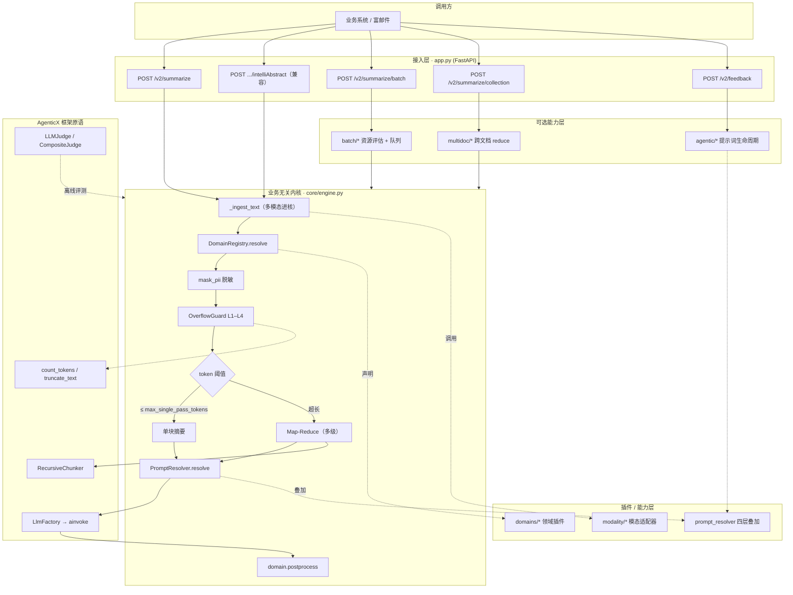
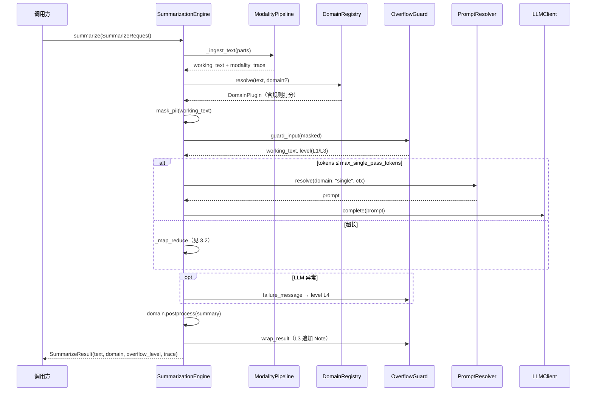
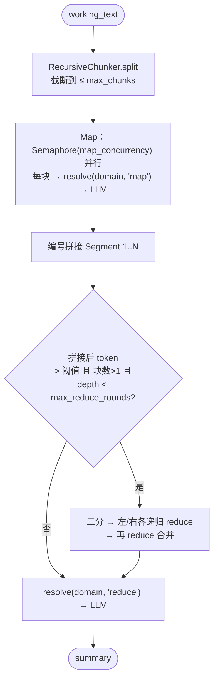
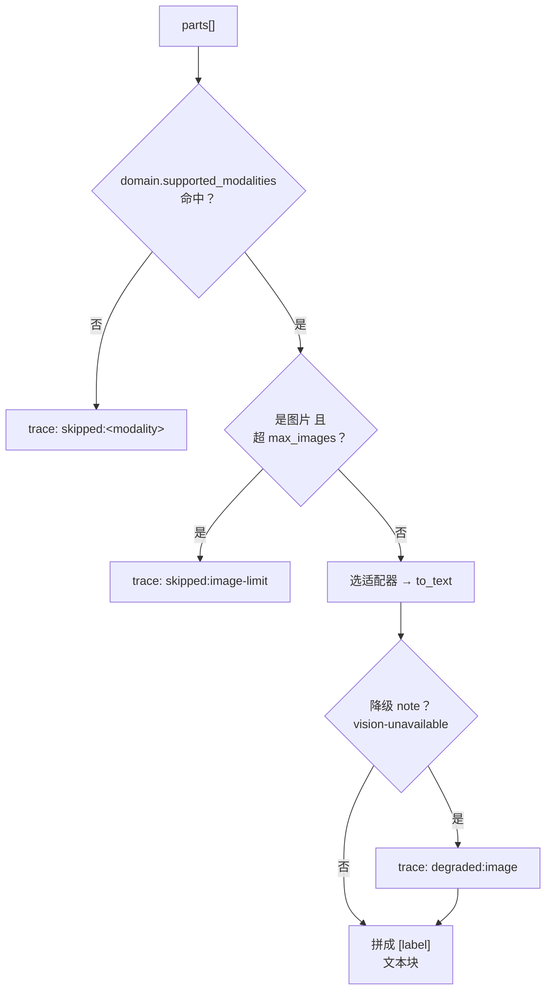
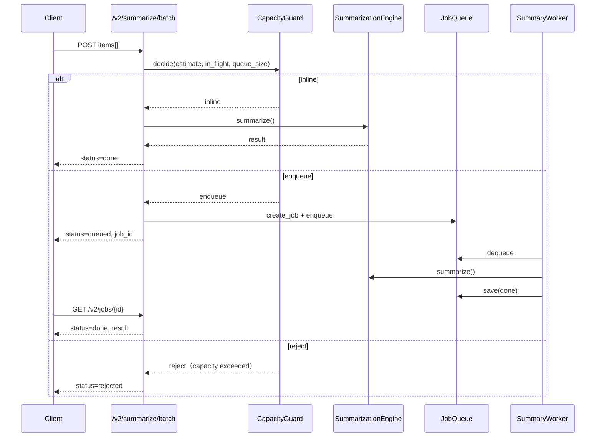
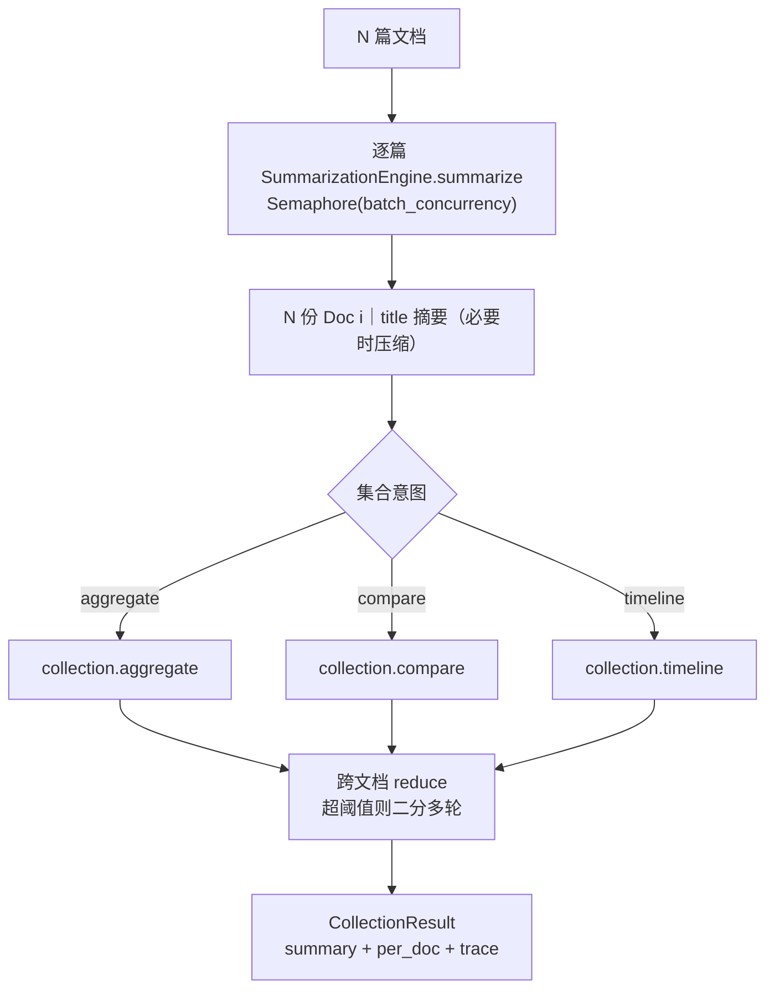
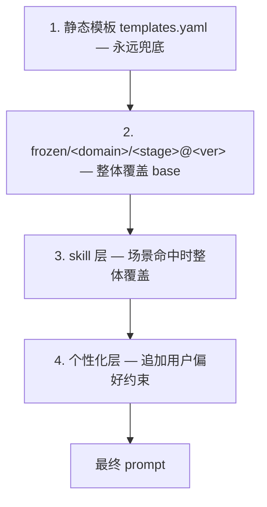

# AgenticX 长文本摘要服务

> 一个**业务无关的摘要内核 + 可插拔领域插件**示例。核心引擎只负责「接入 → 守卫 → 路由 → 解析提示词 → 调用 LLM → 后处理」，邮件 / 新闻等业务差异全部下沉到 `domains/*` 插件；多模态、批处理、多文档、提示词生命周期都是围绕该内核的可选能力层。原 `intelliAbstract` HTTP 契约作为兼容入口保留。

| 项 | 说明 |
|---|---|
| 业务无关内核 | `agenticx_service/core/`（`SummarizationEngine`） |
| 领域插件 | `agenticx_service/domains/`（email / news） |
| 主入口（v2） | `POST /v2/summarize` |
| 兼容入口（v1） | `POST /aibox/richMail/v1.0/intelliAbstract?sid=...` |
| 配置文件 | `config_agenticx.yaml` |
| 旧版代码 | `legacy/`（只读归档，不参与新链路） |

---

## 目录

1. [项目定位](#1-项目定位)
2. [技术架构](#2-技术架构)
3. [核心技术流程](#3-核心技术流程)
4. [目录结构](#4-目录结构)
5. [环境准备与安装](#5-环境准备与安装)
6. [配置说明](#6-配置说明)
7. [启动与 API 调用](#7-启动与-api-调用)
8. [测试与质量评估](#8-测试与质量评估)
9. [相关文档](#9-相关文档)

---

## 1. 项目定位

原 `EmailAbstraction` 用 `requests` 直连大模型、正则脱敏、单段 Prompt 拼完即调。长邮件链 / 深度报道一超上下文就丢信息，极端输入还可能把服务打挂；而且邮件逻辑和摘要逻辑揉在一起，换一个业务域就得改主流程。

本示例把同一条链路重构为**两层解耦**：

- **业务无关内核**（`core/`）：所有领域共享同一条流水线，不出现任何「email / news」字样。它对外只依赖三个协议——`DomainPlugin`（领域差异）、`PromptResolver`（提示词来源）、`ModalityAdapter`（模态转写）。
- **领域插件**（`domains/`）：每个业务域声明自己的规则引擎（意图打分）、提示词 id、支持的模态、后处理逻辑。新增业务域 = 新增一个插件，不动内核。

围绕内核再叠四个**可选能力层**：多模态进核（`modality/`）、批处理与资源评估（`batch/`）、多文档集合摘要（`multidoc/`）、Agent 化提示词生命周期（`agentic/`）。每一层都可单独关闭，关闭后内核行为不变。

> 设计原文见 [`docs/agenticx_optimization_plan.md`](docs/agenticx_optimization_plan.md)；分阶段实施记录见 [`plans/`](plans/)。

---

## 2. 技术架构

### 2.1 分层总览



### 2.2 内核的三个解耦接缝

内核不认识任何业务，靠三个协议把差异挡在外面：

| 接缝 | 协议 | 内核怎么用 | 默认实现 |
|------|------|-----------|----------|
| 领域差异 | `DomainPlugin`（`domains/base.py`） | `registry.resolve(content, explicit)` 选域；用 `prompt_ids()` / `supported_modalities()` / `postprocess()` | email / news 插件 + 各自 `rules.py` 规则引擎 |
| 提示词来源 | `PromptResolver`（`core/prompt_resolver.py`） | `resolve(domain, stage, ctx)` 返回最终 prompt | `StaticPromptResolver`（静态模板）；可换 `LayeredPromptResolver`（四层） |
| 模态转写 | `ModalityAdapter`（`modality/base.py`） | `ModalityPipeline.assemble(parts, supported)` 把非文本转成文本块 | text / code / image / document / audio_video |

### 2.3 框架能力映射

不重复造轮子——示例只做薄封装，重活交给 AgenticX：

| 业务需求 | 本仓库封装 | AgenticX 原语 |
|----------|-----------|---------------|
| 多厂商 LLM | `llm_client.py` | `LlmFactory` + `BaseLLMProvider.ainvoke` |
| 正则脱敏 | `tools/desensitize.py` | `@tool` / `FunctionTool` |
| 长文本分块 | `chunking.py` | `RecursiveChunker`（默认）/ `AgenticChunker` |
| Token 计数 / 截断 | `overflow.py` | `count_tokens` / `truncate_text` |
| 文档解析 | `modality/document.py` | `agenticx.tools.adapters.liteparse` |
| 视觉判定 | `modality/image.py` | `agenticx.llms.vision.is_vision_capable` |
| 质量评测 | `evaluation/judges.py` | `LLMJudge` / `CompositeJudge` |

> 刻意**未**使用 `OverflowRecoveryPipeline`——该组件面向 Agent 编译器事件流，不适合通用文本摘要截断。

---

## 3. 核心技术流程

### 3.1 单文档摘要主流程

内核 `SummarizationEngine.summarize()` 是所有路径（v2 / v1 / 批处理单条 / 多文档逐篇）的唯一执行体：



`trace` 字段对调用方透明暴露执行细节：`domain` / `domain_score` / `stages` / `chunk_count` / `modalities` / `prompt_layers`，便于排障与监控。

### 3.2 Map-Reduce 与多级 reduce

超过 `max_single_pass_tokens` 时走 Map-Reduce；reduce 阶段在合并后 token 仍超阈值时**二分递归**，直到收敛或达 `max_reduce_rounds`：



### 3.3 多模态进核（capability matrix + 降级 trace）

非文本部件在进内核**之前**统一转写为文本块。`ModalityPipeline.assemble` 按领域插件声明的 `supported_modalities` 过滤，不支持的模态 **skip 并记 trace**，从不抛错中断主流程：



| 模态 | 邮件域 | 新闻域 | 转写方式 |
|------|:------:|:------:|----------|
| 文本 | ✅ | ✅ | 直通 |
| 代码 | ✅ | — | 保留围栏 + 语言标注（`code_max_chars` 截断） |
| 图片 | ✅ | ✅ | `is_vision_capable` 时走 vision caption/OCR；否则 meta caption；再否则占位降级 |
| 文档 | ✅ | — | liteparse 解析 pdf/docx/pptx（未安装返回安装提示） |
| 音视频 | 预留 | 预留 | `AudioVideoAdapter` 默认 `ModalityNotSupported` |

### 3.4 批处理资源评估与队列降级

`ResourceEstimator` 先按 token 量算出 LLM 调用数与 provider 负载，`CapacityGuard` 据此在 **inline / enqueue / reject** 间决策：

#### 估算公式

设单条文本 token 数为 `T`，`S = max_single_pass_tokens`，`C = chunk_size`，reduce 扇入 `F = reduce_fan_in`：

| 量 | 公式 |
|----|------|
| 分块数 | `T ≤ S` → `n_chunks=1`；否则 `n_chunks = ceil(T / C)` |
| LLM 调用数 | `T ≤ S` → `calls=1`；否则 `calls = n_chunks + reduce_calls` |
| reduce 轮次 | 每轮 `groups = ceil(remaining / F)`，直至 `remaining ≤ 1` 或达 `max_reduce_rounds` |
| 预计耗时 | 单条 `ceil(calls / map_concurrency) × avg_call_seconds`；批级 `ceil(total_calls / batch_concurrency) × avg_call_seconds` |
| RPM / TPM | `required_rpm ≈ calls / (est_latency_s/60)`；`required_tpm ≈ calls × (min(T,C)+output_budget_tokens) / (est_latency_s/60)` |

`CapacityGuard.decide` 判定顺序：`in_flight ≥ inline_max_concurrency` → 或 `required_rpm > provider_rpm_limit` → 或 `required_tpm > provider_tpm_limit`，命中任一则尝试入队；队列已满（`queue_size ≥ queue_max`）则 reject。

#### 队列降级时序



配置见 `config_agenticx.yaml` 的 `batch:` 段（`batch_concurrency` / `queue_max` / `inline_max_concurrency` / `provider_rpm_limit` / `provider_tpm_limit` / `avg_call_seconds` / `output_budget_tokens` / `reduce_fan_in`）。

### 3.5 多文档集合摘要

两阶段：先逐篇过内核（并发 `batch_concurrency`，单篇摘要超 `per_doc_summary_max_tokens` 时 `truncate_text` 压缩），再按集合意图跨文档 reduce：



| 意图 | 语义 | 模板 |
|------|------|------|
| `aggregate` | 综合归纳共同主题，去重并保留来源编号 | `collection.aggregate` |
| `compare` | 对比共识点 / 分歧点 / 各篇独有观点 | `collection.compare` |
| `timeline` | 抽取时间点，按时间排序成演进脉络 | `collection.timeline` |

**API：** `POST /v2/summarize/collection` — 小集合（`len(docs) ≤ multidoc.sync_max_docs` 且估算 `calls ≤ 20`）同步返回；大集合返回 `202` + `job_id`，经 Phase C worker 异步完成，`GET /v2/jobs/{id}` 查询。

### 3.6 Agent 化提示词四层生命周期

提示词来源可从单一静态模板升级为四层叠加（`LayeredPromptResolver`，`agentic.layered_resolver: true` 启用）：



| 层 | 能力 | 模块 / 入口 |
|----|------|-------------|
| 静态层 | 按 domain.stage 命名空间的模板，永远兜底 | `prompts/templates.yaml` + `StaticPromptResolver` |
| 固化层 | 冷启动评测获胜模板 → `prompts/frozen/` + `manifest.yaml`（版本只增） | `eval_harness.py` + `FrozenPromptStore.freeze()`；CLI `python -m agenticx_service.agentic --freeze` |
| skill 层 | Agent 起草 `SKILL.md` → `agenticx.skills.guard` 扫描 → 落盘；场景命中覆盖 | `SkillAuthor` / `SkillPromptProvider`（`agentic.skill_authoring: true`） |
| 个性化层 | 用户反馈 → 偏好记忆 → **仅追加**「在不违反核心要求前提下…」约束块 | `POST /v2/feedback` + `PersonalizationStore`；`/v2/summarize` 传 `user_id` |

> 关闭 `layered_resolver` 时仅静态层生效，内核行为与单层完全一致。

### 3.7 溢出降级等级

| Level | 触发条件 | 行为 | 用户可见 |
|:-----:|----------|------|----------|
| **L1** | 输入 token ≤ `overflow.max_input_tokens` 且单块 | 正常处理 | 纯摘要 |
| **L2** | 超单块阈值，走 Map-Reduce | 分块并行 + 多级 reduce | 纯摘要 |
| **L3** | 输入 token > `max_input_tokens` | `truncate_text` 硬截断后继续 | 摘要 + `[Note] ...` |
| **L4** | LLM 调用失败或编排异常 | 不抛 500（API 仍 200），返回降级文案 | 固定降级提示 |

`data.overflow_level` 字段透明暴露当前等级，便于监控告警。

### 3.8 intelliAbstract 兼容契约

v1 入口是内核之上的薄 façade：固定以 `SummarizeRequest(content=email_content)` 调用同一内核，响应字段对齐旧服务（`code` / `message` / `text` + `data.scenario` / `data.overflow_level`），存量调用方零改造。

---

## 4. 目录结构

```
AgenticX-LongTextSummarizer/
├── agenticx_service/
│   ├── app.py                 # FastAPI 入口（v1 兼容 + v2 全部端点）
│   ├── core/                  # 业务无关内核
│   │   ├── engine.py          # SummarizationEngine（唯一执行体）
│   │   ├── types.py           # SummarizeRequest/Result、ContentPart、Modality、Stage
│   │   └── prompt_resolver.py # Static / Layered PromptResolver
│   ├── domains/               # 领域插件（email / news + 各自 rules.py）
│   ├── modality/              # 模态适配器（text/code/image/document/audio_video）
│   ├── batch/                 # resource 估算 + queue + worker
│   ├── multidoc/              # 跨文档 reduce（collection + types）
│   ├── agentic/               # 提示词生命周期（eval/freeze/personalization/skill + CLI）
│   ├── prompts/               # 版本化模板（templates.yaml + frozen/）
│   ├── chunking.py            # 分块策略封装
│   ├── overflow.py            # Token 溢出守卫
│   ├── llm_client.py          # LlmFactory 薄封装
│   ├── factory.py             # 装配内核 + 解析器
│   ├── summarizer.py          # v1 SummarizerService（façade）
│   ├── config.py              # YAML 配置模型 + 环境覆盖
│   ├── tools/desensitize.py   # PII 脱敏
│   ├── evaluation/            # LLMJudge 评测集与报告
│   └── tests/                 # Phase 1–4 + A–E 冒烟测试
├── config_agenticx.yaml       # 服务配置
├── plans/                     # 分阶段实施 plan（v1 Phase1–4 + v2 Phase A–E）
├── docs/                      # 优化方案原文
├── legacy/                    # 旧版 api_server 归档
├── requirements.txt
└── pytest.ini
```

---

## 5. 环境准备与安装

### 5.1 前置条件

| 依赖 | 版本建议 | 用途 |
|------|----------|------|
| Python | 3.10+ | 运行时 |
| AgenticX | 本仓库 editable 安装 | LLM / Chunker / Judge / vision / liteparse |
| 可达的 LLM 网关 | LiteLLM 兼容 | 摘要与可选裁判模型 |
| liteparse（可选） | `npm i -g @llamaindex/liteparse` | 文档模态解析 pdf/docx/pptx |

### 5.2 安装步骤

```bash
# 1. 安装 AgenticX（开发模式）
cd /path/to/AgenticX
pip install -e .

# 2. 进入示例目录
cd examples/AgenticX-LongTextSummarizer
pip install -r requirements.txt
```

### 5.3 密钥与代理（按需）

```bash
export AGX_LLM_API_KEY="sk-..."          # 业务模型密钥（留空时回退 config）
export AGX_JUDGE_API_KEY="sk-..."        # 评测裁判模型（可选，分离）
export HTTPS_PROXY="http://proxy.example.com:3128"  # 企业内网代理示例
```

---

## 6. 配置说明

主配置：`config_agenticx.yaml`（缺省段落均有内置默认值，可只覆盖需要的项）。

```yaml
llm:                            # 业务摘要模型
  provider: "litellm"
  model: "gpt-4o-mini"
  api_key: ""                   # 留空则用 AGX_LLM_API_KEY
  temperature: 0.7

domains:
  default: "email"              # 规则打分全 0 时的兜底域

chunking:
  strategy: "recursive"         # recursive（零额外成本）| agentic
  chunk_size: 4000
  max_single_pass_tokens: 3000  # 超过走 Map-Reduce
  map_concurrency: 4
  max_reduce_rounds: 3

modality:
  liteparse_enabled: true
  code_max_chars: 8000
  document_max_chars: 12000
  max_images: 5

batch:
  batch_concurrency: 4
  queue_max: 100
  inline_max_concurrency: 2
  provider_rpm_limit: 60
  provider_tpm_limit: 120000
  avg_call_seconds: 3.0
  output_budget_tokens: 512
  reduce_fan_in: 8

multidoc:
  sync_max_docs: 5              # 超过此数走异步 job
  per_doc_summary_max_tokens: 800

agentic:
  layered_resolver: false       # 四层提示词；或 AGX_SUMMARIZER_LAYERED_RESOLVER=1
  skill_authoring: false
  personalization_max_chars: 400
  frozen_dir: "prompts/frozen"

overflow:
  max_input_tokens: 120000      # 超出触发 L3 截断
  max_chunks: 50

judge_llm:                      # 评测裁判（见 evaluation/）
  model: "gpt-4o-mini"
  temperature: 0.0
```

改 `llm.model` / `llm.base_url` 即可切换供应商，无需改代码。

---

## 7. 启动与 API 调用

### 7.1 启动服务

```bash
cd examples/AgenticX-LongTextSummarizer
PYTHONPATH=".:../../" python -m agenticx_service.app --config config_agenticx.yaml
```

默认监听 `0.0.0.0:8282`，本地可访问 `http://127.0.0.1:8282/docs` 查看 OpenAPI。

### 7.2 v2 单文档摘要（主入口）

```bash
curl -s -X POST http://127.0.0.1:8282/v2/summarize \
  -H 'Content-Type: application/json' \
  -d '{"content":"Subject: 周会\n请周五 10:00 确认参会。","domain":"email"}'
```

响应 `data` 含 `domain`、`overflow_level`、`trace`（`domain_score` / `stages` / `modalities` / `prompt_layers`）。`domain` 留空则由规则引擎自动判定。带 `parts[]`（`{modality,payload,meta}`）可传图片 / 文档 / 代码等多模态部件。

### 7.3 批处理 / 多文档 / 反馈

```bash
# 批处理：按容量自动 inline / 入队 / 拒绝
curl -s -X POST http://127.0.0.1:8282/v2/summarize/batch \
  -H 'Content-Type: application/json' \
  -d '{"items":[{"content":"..."},{"content":"..."}]}'

# 多文档集合摘要
curl -s -X POST http://127.0.0.1:8282/v2/summarize/collection \
  -H 'Content-Type: application/json' \
  -d '{"docs":[{"doc_id":"a","content":"..."},{"doc_id":"b","content":"..."}],"intent":"compare"}'

# 异步任务查询
curl -s http://127.0.0.1:8282/v2/jobs/<job_id>

# 个性化反馈（需 layered_resolver 生效才会注入）
curl -s -X POST http://127.0.0.1:8282/v2/feedback \
  -H 'Content-Type: application/json' \
  -d '{"user_id":"u1","domain":"email","instruction":"摘要请用要点列表"}'
```

### 7.4 v1 兼容契约

**请求**

```http
POST /aibox/richMail/v1.0/intelliAbstract?sid=<会话ID>
Content-Type: application/json

{ "email_content": "邮件或新闻正文……" }
```

**成功响应**

```json
{
  "code": 0,
  "message": "",
  "text": "摘要正文",
  "data": { "scenario": "email", "overflow_level": 1 }
}
```

缺 `sid` / `email_content` 返回 `400` + `code:1`；内部异常返回 `500` + `code:1`。手机号、邮箱等 PII 在进模型前由 `mask_pii` 替换，摘要中不应出现原文。

---

## 8. 测试与质量评估

### 8.1 单元 / 冒烟测试

```bash
cd examples/AgenticX-LongTextSummarizer
PYTHONPATH=".:../../" pytest agenticx_service/tests -q
```

覆盖：脱敏、单块摘要、Map-Reduce（含 lost-in-middle 锚点）、意图路由、溢出降级、多模态 skip/降级、批处理容量决策、jobs 端点、多文档跨域 reduce、提示词评测排名 / skill 落盘、FastAPI 接口契约、评测硬断言等，共 **56** 项。

### 8.2 自动化质量评测（Phase 4）

四组固定用例，对应 `agenticx_service/evaluation/datasets/`：

| 用例 ID | 验证重点 |
|---------|----------|
| `email_short` | PII 不得泄漏（`must_not` 硬失败） |
| `email_long_chain` | 8000+ 字邮件链首尾锚点召回 |
| `news_deep` | 5W1H 事实覆盖（`fact_5w1h_coverage`） |
| `news_overflow` | 超长输入不崩溃（`require_no_crash`） |

```bash
# 默认 Mock LLM + Stub，适合 CI / 无密钥环境
PYTHONPATH=".:../../" python -m agenticx_service.evaluation.run_eval

# 接入真实裁判模型
export AGX_JUDGE_API_KEY="sk-..."
export AGX_EVAL_USE_MOCK_JUDGE=0
PYTHONPATH=".:../../" python -m agenticx_service.evaluation.run_eval
```

报告输出：`agenticx_service/evaluation/report_<timestamp>.json` 与同目录 `.md`，含分维度得分与 `hard_failures` 明细。

### 8.3 提示词冷启动评测与固化（Phase E）

```bash
# 评测候选模板并排名（默认 Mock 裁判）
PYTHONPATH=".:../../" python -m agenticx_service.agentic --domain email --dataset email_short.json

# 评测后固化获胜模板到 prompts/frozen/
PYTHONPATH=".:../../" python -m agenticx_service.agentic --candidate my_prompt.txt --freeze
```

---

## 9. 相关文档

| 文档 | 内容 |
|------|------|
| [`docs/agenticx_optimization_plan.md`](docs/agenticx_optimization_plan.md) | 从旧实现到 AgenticX 的优化方案原文 |
| [`plans/`](plans/) | v1 Phase 1–4 与 v2 Phase A–E 实施 plan |
| [`legacy/README.md`](legacy/README.md) | 旧版 `api_server.py` 归档与启停说明 |

---

**Author:** Damon Li
