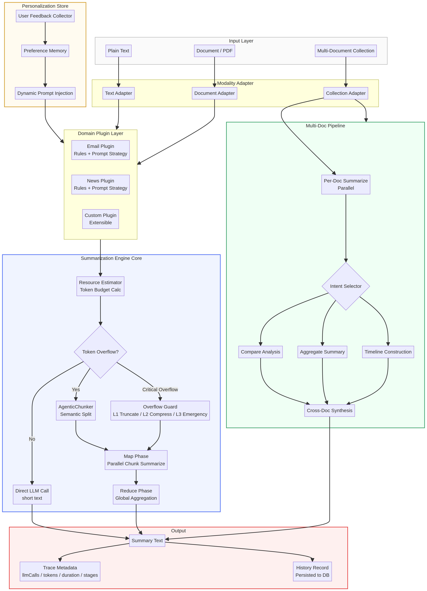
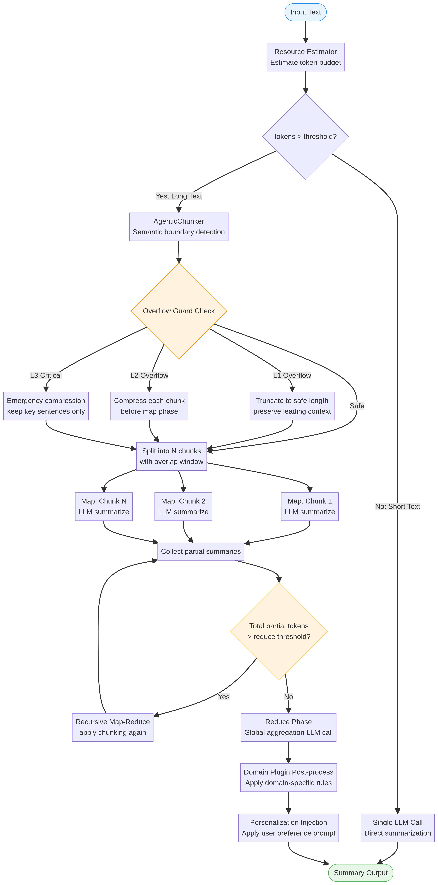
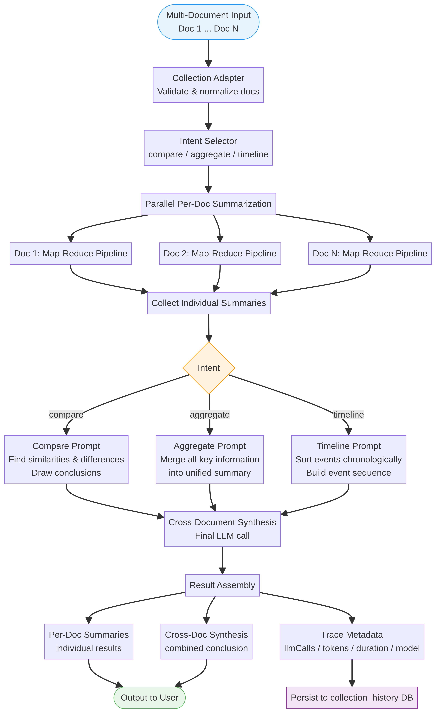

# AgenticX-LongTextSummarizer

A production-grade long-text summarization engine built on the [AgenticX](https://github.com/DemonDamon/AgenticX) framework. The system decouples the summarization core from business domains through a pluggable architecture, enabling scalable processing of arbitrarily long documents via Map-Reduce parallelism, multi-level overflow recovery, and cross-document synthesis.

A live demo is available at the project website, where you can test single-document summarization, multi-document comparison, and inspect the full processing trace including LLM call count, token usage, elapsed time, and pipeline stages.

---

## Table of Contents

- [Architecture Overview](#architecture-overview)
- [Single-Document Pipeline: Map-Reduce Flow](#single-document-pipeline-map-reduce-flow)
- [Multi-Document Collection Pipeline](#multi-document-collection-pipeline)
- [Core Features](#core-features)
- [Project Structure](#project-structure)
- [Installation](#installation)
- [Usage](#usage)
- [Web Platform](#web-platform)
- [Roadmap](#roadmap)
- [License](#license)

---

## Architecture Overview

The system is organized into five layers: input normalization, modality adaptation, domain plugin dispatch, the summarization engine core, and output with persistence. The Personalization Store operates as a cross-cutting concern, injecting user preference context into the prompt at runtime.



The **Summarization Engine Core** handles token budget estimation, overflow detection, semantic chunking, and the Map-Reduce pipeline. The **Multi-Doc Pipeline** runs per-document summarization in parallel before applying intent-driven cross-document synthesis. Both pipelines converge at the same output layer, which records trace metadata and persists results to the history database.

---

## Single-Document Pipeline: Map-Reduce Flow

For short texts (estimated tokens below the threshold), the engine issues a single LLM call. For long texts, it invokes `AgenticChunker` for semantic boundary detection, then applies a three-level overflow guard before entering the parallel Map phase.



The three overflow levels operate as follows. **L1** truncates the input to a safe length while preserving leading context. **L2** compresses each chunk individually before the Map phase begins. **L3** is an emergency mode that retains only the highest-salience sentences. After the Map phase collects partial summaries, the system checks whether their combined length exceeds the Reduce threshold; if so, it applies recursive Map-Reduce until the aggregation is safe to execute. Domain plugin post-processing and personalization injection are applied as the final steps before output.

---

## Multi-Document Collection Pipeline

The collection pipeline accepts one to ten documents simultaneously. Each document is processed through the full single-document Map-Reduce pipeline in parallel. Once all individual summaries are collected, the system routes to one of three cross-document synthesis strategies based on the selected intent.



The three intent modes are defined as follows.

| Intent | Behavior |
|---|---|
| `compare` | Identifies similarities and differences across documents; draws a comparative conclusion |
| `aggregate` | Merges all key information into a single unified summary covering all sources |
| `timeline` | Sorts events chronologically across documents and constructs an event sequence |

The final cross-document synthesis is a single LLM call that receives all individual summaries as context. The result assembly stage produces three outputs: per-document summaries, the cross-document synthesis, and a trace metadata record that is persisted to the `collection_history` table.

---

## Core Features

**Business-agnostic core with pluggable domain adapters.** The `SummarizationEngine` has no knowledge of specific business domains. Email and News scenarios are implemented as independent `DomainPlugin` instances, each maintaining its own rule engine and prompt strategy. New domains can be added without modifying the core.

**Semantic chunking with overlap windows.** `AgenticChunker` detects semantic boundaries rather than splitting on fixed character counts. Chunks are produced with configurable overlap to prevent information loss at boundaries. `RecursiveChunker` is available as a fallback for documents with irregular structure.

**Multi-level token overflow recovery.** The `ResourceEstimator` computes a token budget before any LLM call is issued. The `OverflowGuard` intercepts requests that exceed safe context limits and applies the appropriate recovery strategy (L1 through L3) automatically, preventing silent truncation or API errors.

**Parallel Map phase with recursive Reduce.** Map-phase chunks are processed concurrently. If the collected partial summaries still exceed the Reduce threshold, the system applies Map-Reduce recursively until the aggregation is feasible. This allows the engine to handle documents of arbitrary length without manual intervention.

**Multi-document cross-document synthesis.** Up to ten documents can be submitted in a single collection request. Per-document summarization runs in parallel, and the synthesis step applies one of three intent-driven strategies (compare, aggregate, timeline) to produce a cross-document conclusion.

**Personalization memory injection.** `PersonalizationStore` records user feedback and style preferences. At runtime, the stored preferences are injected into the system prompt before each LLM call, enabling the engine to adapt its output style to individual users over time.

**Full trace metadata.** Every summarization result includes a structured trace: number of LLM calls, estimated prompt tokens, elapsed time in milliseconds, pipeline stages executed, and the model identifier. This data is persisted to the history database and is exportable as CSV or Excel for offline analysis.

---

## Project Structure

```
agenticx_service/
  core/           Summarization engine, pipeline, prompt resolver
  domains/        Domain plugins: Email, News, and extensible base
  modality/       Modality adapters: Text, Code, Document
  batch/          Batch processing, resource estimation, queue degradation
  multidoc/       Multi-document collection pipeline
  agentic/        Personalization store and dynamic prompt lifecycle
  tools/          Utility layer (e.g., desensitization)

client/           React 19 frontend (Vite + Tailwind + tRPC)
server/           Express 4 backend with tRPC procedures
drizzle/          Database schema and migrations (MySQL / TiDB)
docs/             Architecture diagrams and technical documentation
```

---

## Installation

**Requirements:** Python 3.10 or later. A virtual environment manager such as `conda` or `venv` is recommended.

```bash
git clone https://github.com/DemonDamon/AgenticX-LongTextSummarizer.git
cd AgenticX-LongTextSummarizer

conda create -n agenticx-summarizer python=3.10
conda activate agenticx-summarizer

pip install -r requirements.txt
```

Set the LLM API key before starting the service:

```bash
export AGX_LLM_API_KEY="your-api-key"
```

If you are running against a local or self-hosted AgenticX installation, point the base URL accordingly:

```bash
export AGX_LLM_BASE_URL="https://your-llm-endpoint/v1"
```

---

## Usage

### Start the API service

```bash
uvicorn agenticx_service.app:app --host 0.0.0.0 --port 8282 --reload
```

### Single-document summarization

```bash
curl -X POST http://localhost:8282/v2/summarize \
  -H "Content-Type: application/json" \
  -d '{
    "content": "Insert long document text here...",
    "domain": "news",
    "user_id": "user_123"
  }'
```

The response includes the summary text and a `trace` object with `llm_calls`, `prompt_tokens`, `duration_ms`, `stages`, and `is_map_reduce`.

### Multi-document collection

```bash
curl -X POST http://localhost:8282/v2/collection \
  -H "Content-Type: application/json" \
  -d '{
    "intent": "compare",
    "docs": [
      {"doc_id": "doc1", "title": "Report A", "content": "..."},
      {"doc_id": "doc2", "title": "Report B", "content": "..."}
    ],
    "user_id": "user_123"
  }'
```

### Submit user preference feedback

```bash
curl -X POST http://localhost:8282/v2/feedback \
  -H "Content-Type: application/json" \
  -d '{
    "user_id": "user_123",
    "domain": "email",
    "instruction": "Keep all email summaries under 50 words and avoid formal language."
  }'
```

---

## Web Platform

The repository includes a full-stack web application for interactive demonstration and history tracking. The frontend is built with React 19, Tailwind CSS 4, and tRPC. The backend is Express 4 with Drizzle ORM on MySQL/TiDB.

Key capabilities of the web platform:

- Single-document summarization with model selection (supports OpenAI, Anthropic, Google, DeepSeek, Qwen, Kimi, GLM, Hunyuan, Yi, ERNIE, and Doubao)
- Multi-document collection with intent selection and per-document result breakdown
- Processing trace display: LLM call count, token consumption, elapsed time, pipeline stages
- History persistence for both single-document and collection results, accessible per authenticated user
- Export of history records to CSV or Excel, including all trace metadata and document snippets

To run the web platform locally:

```bash
cd AgenticX-LongTextSummarizer
pnpm install
pnpm dev
```

---

## Roadmap

The following capabilities are planned or under active development.

| Area | Item |
|---|---|
| Chunking | Sentence-level semantic similarity chunking via embedding models |
| Modality | Audio and video transcript ingestion via Whisper |
| Batch | Priority queue with per-user rate limiting and degradation policies |
| Personalization | Feedback-driven prompt fine-tuning with A/B evaluation |
| Observability | OpenTelemetry trace export for LLM call latency and token cost |
| API | Streaming response support for real-time summary delivery |

---

## License

MIT License. See [LICENSE](LICENSE) for details.
