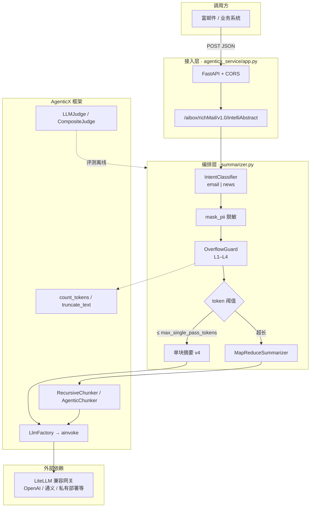
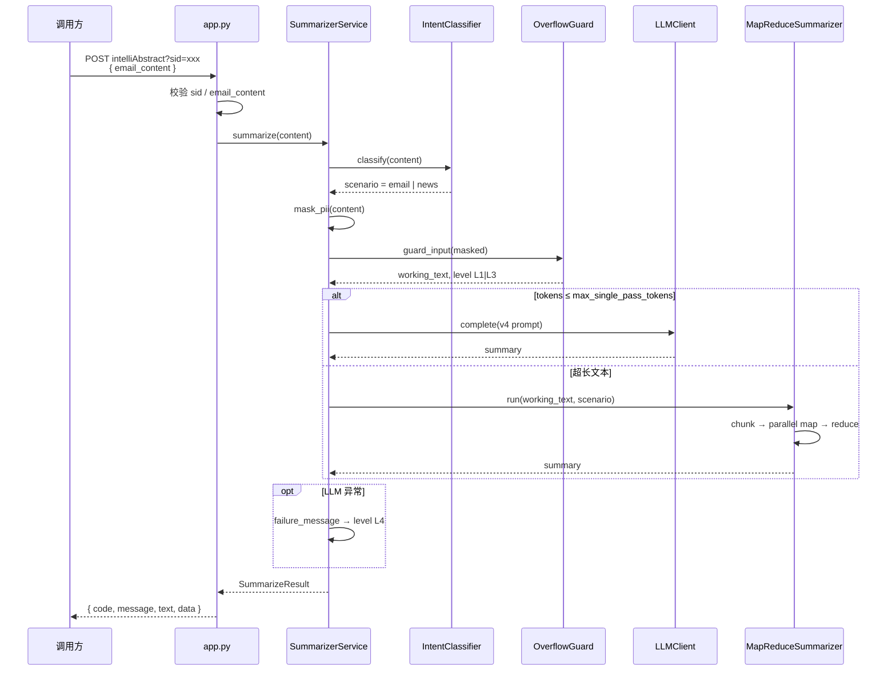
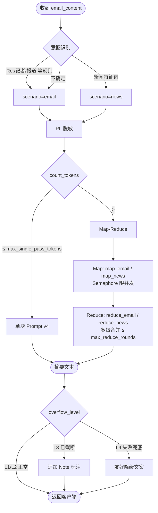
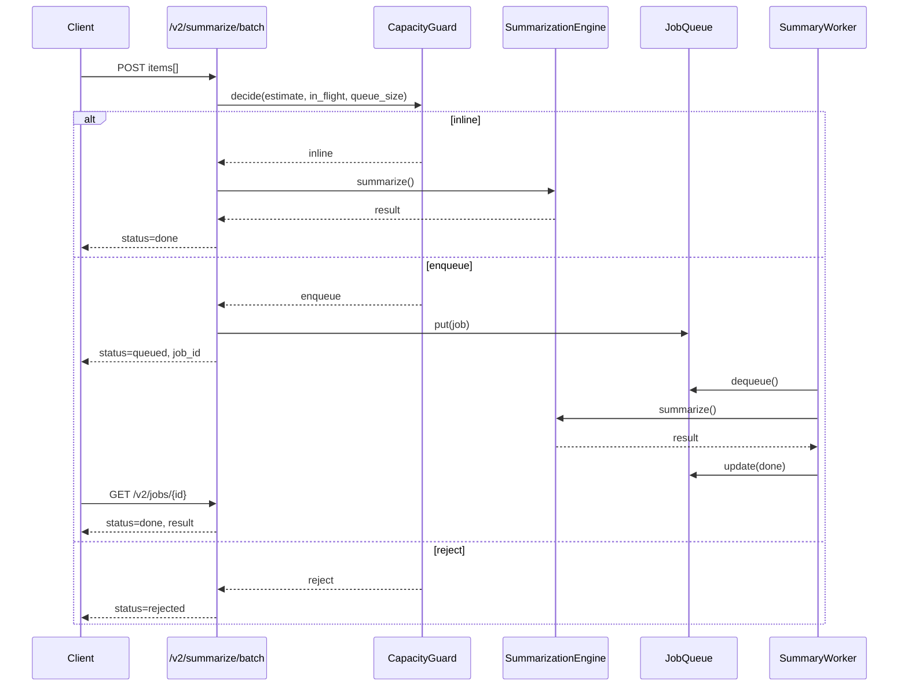
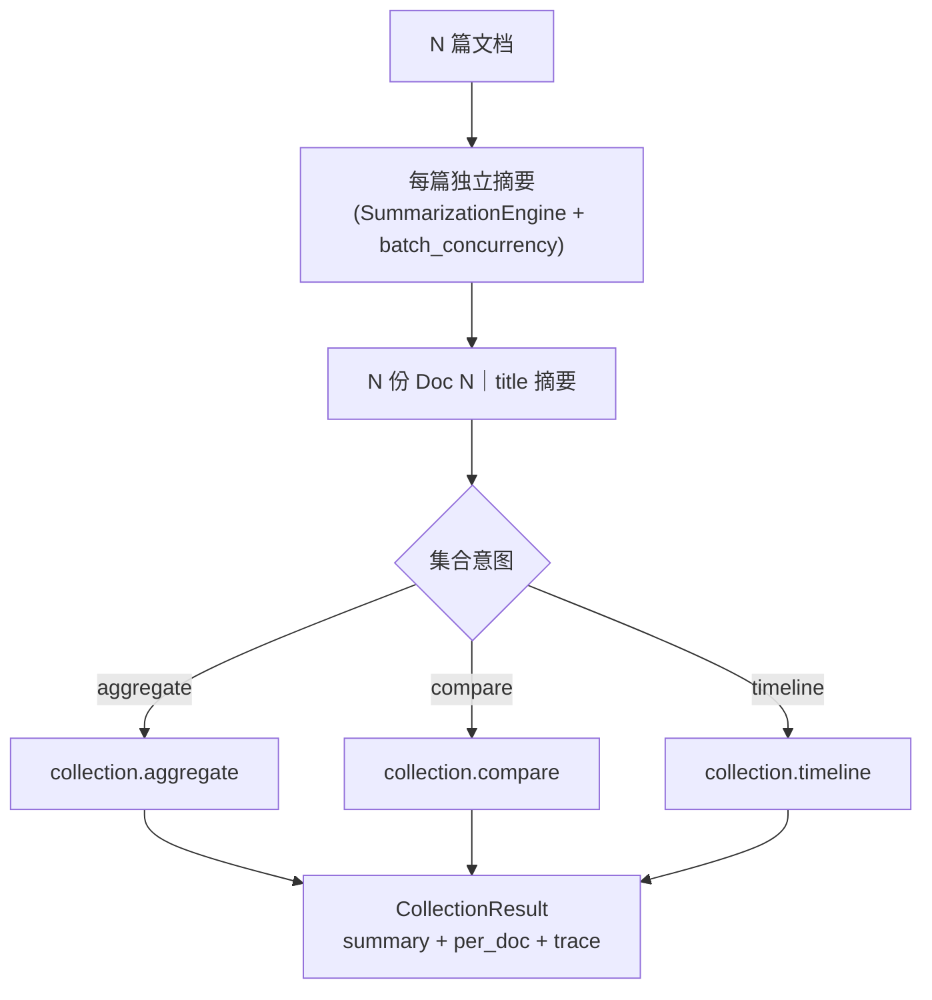
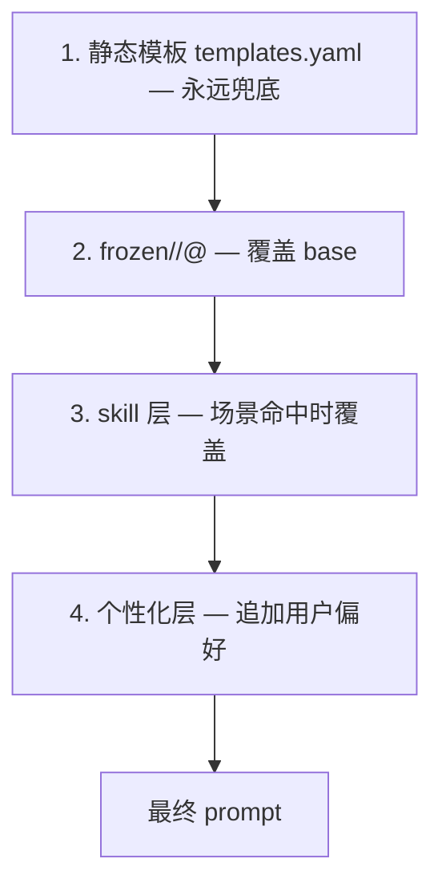

# AgenticX 长文本摘要服务

> 邮件 / 新闻长文本的智能摘要示例。在保留原 `intelliAbstract` HTTP 契约的前提下，用 AgenticX 统一 LLM 调用、分块、Token 治理与质量评测。

| 项 | 说明 |
|---|---|
| 入口 | `POST /aibox/richMail/v1.0/intelliAbstract?sid=...` |
| 实现包 | `agenticx_service/` |
| 配置文件 | `config_agenticx.yaml` |
| 旧版代码 | `legacy/`（只读归档，不参与新链路） |

---

## 目录

1. [项目定位](#1-项目定位)
2. [技术架构](#2-技术架构)
3. [核心业务流程](#3-核心业务流程)
4. [目录结构](#4-目录结构)
5. [环境准备与安装](#5-环境准备与安装)
6. [配置说明](#6-配置说明)
7. [启动与 API 调用](#7-启动与-api-调用)
8. [测试与质量评估](#8-测试与质量评估)
9. [相关文档](#9-相关文档)

---

## 1. 项目定位

原 `EmailAbstraction` 用 `requests` 直连大模型、正则脱敏、单段 Prompt 拼完即调。长邮件链和深度报道一超上下文就丢信息，极端输入还可能直接把服务打挂。

本示例把同一条业务链路迁到 AgenticX 上，拆成四层能力：

| 层次 | 做什么 |
|------|--------|
| 接入层 | FastAPI + Uvicorn，响应字段与旧服务对齐（`code` / `message` / `text`），额外透出 `scenario`、`overflow_level` |
| 编排层 | `SummarizerService`：意图识别 → 脱敏 → 溢出守卫 → 单块 or Map-Reduce |
| 能力层 | `LlmFactory`、`RecursiveChunker`、`TokenCounter`、`LLMJudge` 等框架内建能力 |
| 治理层 | 分维度自动化评测 + PII / 崩溃硬断言 |

设计细节见 [`docs/agenticx_optimization_plan.md`](docs/agenticx_optimization_plan.md)；分阶段实施记录见 [`plans/`](plans/)。

---

## 2. 技术架构

### 2.1 分层总览



### 2.2 框架能力映射

不重复造轮子——示例代码只做薄封装，核心能力来自 AgenticX：

| 业务需求 | 本仓库封装 | AgenticX 原语 |
|----------|-----------|---------------|
| 多厂商 LLM | `llm_client.py` | `LlmFactory` + `BaseLLMProvider.ainvoke` |
| 正则脱敏 | `tools/desensitize.py` | `@tool` / `FunctionTool` |
| 长文本分块 | `chunking.py` | `RecursiveChunker`（默认）/ `AgenticChunker` |
| Token 计数 / 截断 | `overflow.py` | `count_tokens` / `truncate_text` |
| 质量评测 | `evaluation/judges.py` | `LLMJudge` / `CompositeJudge` |

> 刻意**未**使用 `OverflowRecoveryPipeline`——该组件面向 Agent 编译器事件流，不适合通用文本摘要截断。

---

## 3. 核心业务流程

### 3.1 单次请求时序



### 3.2 路由与摘要策略



### 3.3 溢出降级等级

| Level | 触发条件 | 行为 | 用户可见 |
|:-----:|----------|------|----------|
| **L1** | 输入 token ≤ `overflow.max_input_tokens` | 正常处理 | 纯摘要 |
| **L2** | 超过单块阈值，走 Map-Reduce | 分块并行摘要 | 纯摘要 |
| **L3** | 输入 token > `max_input_tokens` | `truncate_text` 硬截断后继续 | 摘要 + `[Note] ...` |
| **L4** | LLM 调用失败或编排异常 | 不抛 500（API 仍 200） | 固定降级提示文案 |

`data.overflow_level` 字段对调用方透明暴露当前等级，便于监控与告警。

### 3.4 意图识别（默认 `rule` 模式）

| 场景 | 典型特征 | Map / Reduce 模板 |
|------|----------|-------------------|
| `email` | `Re:`、`转发`、`Subject:`、行动项措辞 | `map_email` → `reduce_email` |
| `news` | `记者`、`报道`、`据悉`、机构名 | `map_news` → `reduce_news` |

`intent.mode` 可切 `llm` / `hybrid`；生产默认 `rule`，零额外 LLM 开销。

---

## 4. 目录结构

```
AgenticX-LongTextSummarizer/
├── agenticx_service/          # 新实现（主路径）
│   ├── app.py                 # FastAPI HTTP 入口（Uvicorn 启动）
│   ├── summarizer.py          # 摘要编排中枢
│   ├── mapreduce.py           # Map-Reduce 引擎
│   ├── chunking.py            # 分块策略封装
│   ├── intent.py              # 邮件 / 新闻路由
│   ├── overflow.py            # Token 溢出守卫
│   ├── llm_client.py          # LlmFactory 薄封装
│   ├── config.py              # YAML 配置模型
│   ├── prompts/               # 版本化模板（v4 + map/reduce）
│   ├── tools/desensitize.py   # PII 脱敏
│   ├── evaluation/            # LLMJudge 评测集与报告
│   └── tests/                 # Phase 1–4 冒烟测试
├── config_agenticx.yaml       # 服务配置
├── plans/                     # 分阶段实施 plan
├── docs/                      # 优化方案原文
├── legacy/                    # 旧版 api_server 归档
├── requirements.txt
└── pytest.ini
```

---

## 5. 环境准备与安装

### 5.1 前置条件

| 依赖 | 版本建议 | 用途 |
|------|----------|------|
| Python | 3.10+ | 运行时 |
| AgenticX | 本仓库 editable 安装 | LLM / Chunker / Judge |
| 可达的 LLM 网关 | LiteLLM 兼容 | 摘要与可选裁判模型 |

### 5.2 安装步骤

在 **AgenticX 仓库根目录**安装框架，再安装本示例依赖：

```bash
# 1. 安装 AgenticX（开发模式）
cd /path/to/AgenticX
pip install -e .

# 2. 进入示例目录
cd examples/AgenticX-LongTextSummarizer
pip install -r requirements.txt
```

### 5.3 密钥与代理（按需）

```bash
# 业务模型密钥（写入 config 前优先读环境变量）
export AGX_LLM_API_KEY="sk-..."

# 评测裁判模型（与业务模型分离，可选）
export AGX_JUDGE_API_KEY="sk-..."

# 企业内网代理示例
export HTTPS_PROXY="http://proxy.example.com:3128"
```

---

## 6. 配置说明

主配置：`config_agenticx.yaml`

```yaml
server:
  host: "0.0.0.0"
  port: 8282

llm:                          # 业务摘要模型
  provider: "litellm"
  model: "gpt-4o-mini"
  api_key: ""                 # 留空则用 AGX_LLM_API_KEY
  temperature: 0.7

chunking:
  strategy: "recursive"         # recursive（零额外成本）| agentic
  max_single_pass_tokens: 3000  # 超过则走 Map-Reduce
  map_concurrency: 4          # Map 阶段并发上限
  max_reduce_rounds: 3

intent:
  mode: "rule"                  # rule | llm | hybrid

overflow:
  max_input_tokens: 120000      # 超出触发 L3 截断
  max_chunks: 50

judge_llm:                      # 评测裁判（见 evaluation/）
  model: "gpt-4o-mini"
  temperature: 0.0
```

改 `llm.model` / `llm.base_url` 即可切换供应商，无需改代码。

---

## 7. 启动与 API 调用

### 7.1 启动服务

HTTP 层为 **FastAPI**，由 **Uvicorn** 承载（`app.py` 的 `main()` 已封装，无需单独起 uvicorn 命令）：

```bash
cd examples/AgenticX-LongTextSummarizer
PYTHONPATH=".:../../" python -m agenticx_service.app --config config_agenticx.yaml
```

默认监听 `0.0.0.0:8282`。本地调试时可访问 `http://127.0.0.1:8282/docs` 查看 OpenAPI 文档。

### 7.2 请求 / 响应契约

**请求**

```http
POST /aibox/richMail/v1.0/intelliAbstract?sid=<会话ID>
Content-Type: application/json

{
  "email_content": "邮件或新闻正文……"
}
```

**成功响应**

```json
{
  "code": 0,
  "message": "",
  "text": "摘要正文",
  "data": {
    "scenario": "email",
    "overflow_level": 1
  }
}
```

**失败响应**（缺参 / 内部错误）

```json
{
  "code": 1,
  "message": "错误原因",
  "text": ""
}
```

### 7.3 调用示例

```bash
curl -s -X POST \
  'http://127.0.0.1:8282/aibox/richMail/v1.0/intelliAbstract?sid=demo-001' \
  -H 'Content-Type: application/json' \
  -d '{"email_content":"Subject: 周会\n\n请周五 10:00 确认参会，联系 alice@example.com。"}'
```

> 手机号、邮箱等 PII 在进模型前会被 `mask_pii` 替换，摘要中不应出现原文。

---

## 8. 测试与质量评估

### 8.1 单元 / 冒烟测试

```bash
cd examples/AgenticX-LongTextSummarizer
PYTHONPATH=".:../../" pytest agenticx_service/tests -q
```

当前覆盖：脱敏、单块摘要、Map-Reduce（含 lost-in-middle 锚点）、意图路由、溢出降级、FastAPI 接口契约、评测硬断言等 **20** 项。

### 8.2 自动化质量评测（Phase 4）

四组固定用例，对应 `agenticx_service/evaluation/datasets/`：

| 用例 ID | 验证重点 |
|---------|----------|
| `email_short` | PII 不得泄漏（`must_not` 硬失败） |
| `email_long_chain` | 8000+ 字邮件链首尾锚点召回 |
| `news_deep` | 5W1H 事实覆盖（`fact_5w1h_coverage`） |
| `news_overflow` | 超长输入不崩溃（`require_no_crash`） |

```bash
# 默认 Mock LLM + Stub 服务，适合 CI / 无密钥环境
PYTHONPATH=".:../../" python -m agenticx_service.evaluation.run_eval

# 接入真实裁判模型
export AGX_JUDGE_API_KEY="sk-..."
export AGX_EVAL_USE_MOCK_JUDGE=0
PYTHONPATH=".:../../" python -m agenticx_service.evaluation.run_eval
```

报告输出：`agenticx_service/evaluation/report_<timestamp>.json` 与同目录 `.md`，含分维度得分（`faithfulness` / `conciseness` / 场景维度）与 `hard_failures` 明细。

---

## 9. 相关文档

| 文档 | 内容 |
|------|------|
| [`docs/agenticx_optimization_plan.md`](docs/agenticx_optimization_plan.md) | 从旧实现到 AgenticX 的优化方案原文 |
| [`plans/README.md`](plans/README.md) | Phase 1–4 实施 plan 索引 |
| [`legacy/README.md`](legacy/README.md) | 旧版 `api_server.py` 归档与启停说明 |

---

## 10. Summarizer v2（业务无关内核 + 领域插件）

v2 在保留 `intelliAbstract` 兼容契约的同时，新增通用摘要能力与可插拔架构：

| 能力 | 入口 / 模块 |
|------|-------------|
| 通用单文档摘要 | `POST /v2/summarize` → `core/engine.py` + `domains/*` |
| 多模态转写（进核前） | `parts[]` + `modality/*` |
| 批处理 + 资源评估 | `POST /v2/summarize/batch`、`GET /v2/jobs/{id}` → `batch/*` |
| 多文档集合摘要 | `POST /v2/summarize/collection` → `multidoc/*` |
| Agent 化提示词生命周期 | `POST /v2/feedback`、`python -m agenticx_service.agentic` → `agentic/*` |

### 10.1 v2 单文档 API

```bash
curl -s -X POST http://127.0.0.1:8282/v2/summarize \
  -H 'Content-Type: application/json' \
  -d '{"content":"Subject: Sync\nPlease confirm.","domain":"email"}'
```

响应 `data` 含 `domain`、`overflow_level`、`trace`（记录 domain/stages/modalities）。

### 10.2 多模态能力矩阵

| 模态 | 邮件域 | 新闻域 | 转写方式 |
|------|:------:|:------:|----------|
| 文本 | ✅ | ✅ | 直通 |
| 代码 | ✅ | — | 保留围栏 + 语言标注 |
| 图片 | ✅ | ✅ | vision caption/OCR 或 meta 注入；无 vision 时占位降级 |
| 文档 | ✅ | — | liteparse（可关；未安装时返回安装提示） |
| 音视频 | 预留 | 预留 | 调用即 `ModalityNotSupported` |

### 10.3 批处理与资源评估

#### 估算公式

设单条文本 token 数为 `T`，`S = max_single_pass_tokens`，`C = chunk_size`，reduce 扇入 `F = reduce_fan_in`：

| 量 | 公式 |
|----|------|
| 分块数 | `n_chunks = ceil(T / C)`（仅当 `T > S`） |
| LLM 调用数 | `T ≤ S` → `calls = 1`；否则 `calls = n_chunks + reduce_calls` |
| reduce 轮次 | 每轮 `groups = ceil(remaining / F)`，直至 `remaining ≤ 1` 或达 `max_reduce_rounds` |
| 预计耗时 | `est_latency_s ≈ ceil(calls / map_concurrency) × avg_call_seconds`（批级再除以 `batch_concurrency`） |
| TPM / RPM | `required_tpm ≈ calls × (min(T,C) + output_budget_tokens) / (est_latency_s/60)` |

`ResourceEstimate` 结构化返回：`n_chunks`、`calls`、`est_latency_s`、`required_tpm`、`required_rpm`、`est_mem_bytes`。

#### 算例 1：单条 ~1 万 token 长文

默认 `chunk_size=4000`、`max_single_pass_tokens=3000`、`reduce_fan_in=8`、`map_concurrency=4`、`avg_call_seconds=3`：

- `n_chunks = ceil(10000/4000) = 3`
- `map_calls = 3`；reduce 约 1 次 → **`calls ≈ 4`**
- `est_latency_s ≈ ceil(4/4)×3 = 3s`
- 若 `output_budget_tokens=512`：`required_rpm ≈ 4 / (3/60) ≈ 80`

#### 算例 2：批量 10 条短邮件

每条 `T=200 ≤ S`，`calls=1`；批级 `total_calls=10`，`batch_concurrency=4`：

- `est_latency_s ≈ ceil(10/4)×3 = 9s`
- 适合 inline；若 `in_flight ≥ inline_max_concurrency` 则 `CapacityGuard` 返回 `enqueue`

#### 队列降级时序



配置项见 `config_agenticx.yaml` 的 `batch:` 段（`batch_concurrency`、`queue_max`、`inline_max_concurrency`、`provider_rpm_limit`、`provider_tpm_limit`、`avg_call_seconds`、`output_budget_tokens`）。

### 10.4 多文档集合摘要

#### 两阶段结构



#### 三种集合意图

| 意图 | 语义 | 模板 |
|------|------|------|
| `aggregate` | 综合归纳共同主题，去重并保留来源编号 | `collection.aggregate` |
| `compare` | 对比共识点 / 分歧点 / 各篇独有观点 | `collection.compare` |
| `timeline` | 抽取时间点，按时间排序成演进脉络 | `collection.timeline` |

每篇文档先走 Phase A 引擎（含领域路由、多模态、溢出 guard）；跨文档 reduce 输入格式为 `Doc N｜title` + 摘要正文。总量超 `max_single_pass_tokens` 时多级 cross reduce（`max_reduce_rounds` 收敛）。

**API：** `POST /v2/summarize/collection` — 小集合（≤ `multidoc.sync_max_docs` 且估算可控）同步返回 `summary`/`per_doc`/`trace`；大集合返回 `202` + `job_id`，经 Phase C worker 异步完成，可 `GET /v2/jobs/{id}` 查询。

### 10.5 Agent 化提示词生命周期

提示词按四层叠加（`LayeredPromptResolver`，`agentic.layered_resolver: true` 启用）：



| 阶段 | 能力 | 模块 / 入口 |
|------|------|-------------|
| 冷启动评测 | 多候选 × 数据集 → 排名报告 | `python -m agenticx_service.agentic` + `eval_harness.py` |
| 固化 | 获胜模板 → `prompts/frozen/` + `manifest.yaml` | `FrozenPromptStore.freeze()` / CLI `--freeze` |
| 个性化 | 用户反馈 → 记忆 → 追加约束段 | `POST /v2/feedback`，`/v2/summarize` 传 `user_id` |
| 场景扩展 | Agent 起草 SKILL.md → guard 扫描 → 落盘 | `SkillAuthor`（`agentic.skill_authoring: true`） |

- **静态层**：`prompts/templates.yaml`（永远兜底；`layered_resolver=false` 时仅本层，A–D 行为不变）
- **固化层**：`prompts/frozen/` + `FrozenPromptStore`（版本只增，manifest 切换生效版本）
- **skill 层**：`~/.agenticx/skills/summarizer/`（默认关 `agentic.skill_authoring`）
- **个性化层**：`POST /v2/feedback` 写入偏好，仅**追加**「在不违反上述核心摘要要求的前提下…」约束块

启用分层解析：`agentic.layered_resolver: true` 或 `AGX_SUMMARIZER_LAYERED_RESOLVER=1`。

---

**Author:** Damon Li
