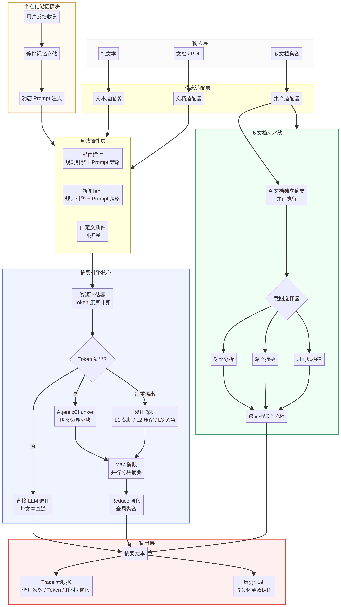
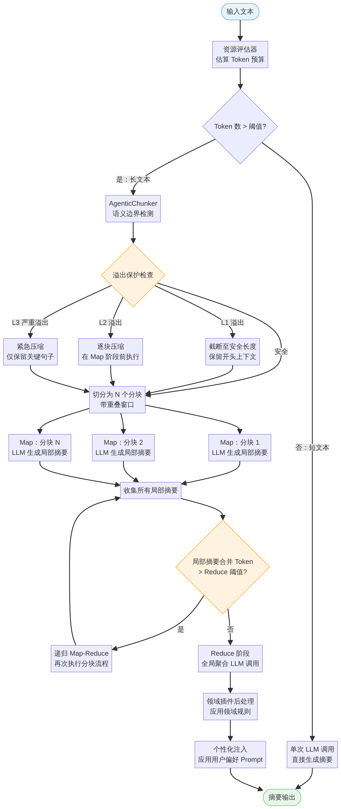
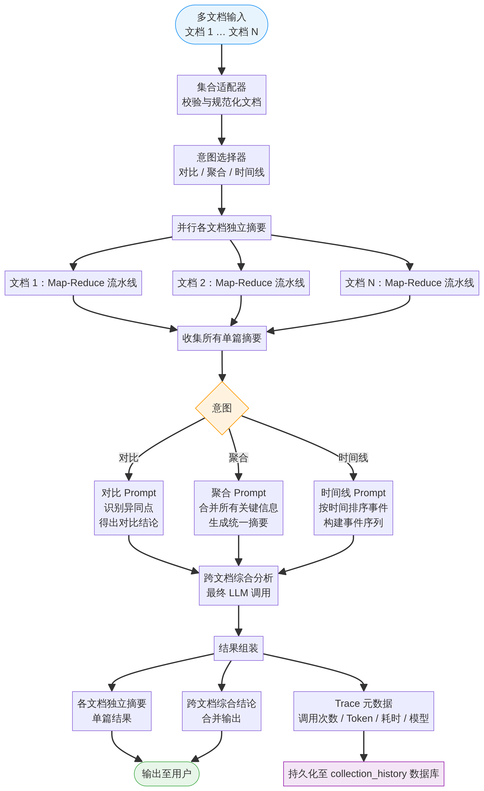

# AgenticX-LongTextSummarizer

基于 [AgenticX](https://github.com/DemonDamon/AgenticX) 框架构建的生产级长文本摘要引擎。系统通过可插拔的领域插件架构，将摘要核心与具体业务场景彻底解耦，借助 Map-Reduce 并行处理、多级 Token 溢出恢复与跨文档综合分析，实现对任意长度文档的可扩展处理。

项目提供在线演示站点，可直接体验单篇摘要、多文档对比，并查看包含 LLM 调用次数、Token 消耗、耗时及处理阶段的完整 Trace 信息。

---

## 目录

- [系统架构概览](#系统架构概览)
- [单篇文档处理流程：Map-Reduce](#单篇文档处理流程map-reduce)
- [多文档聚合处理流程](#多文档聚合处理流程)
- [核心特性](#核心特性)
- [项目结构](#项目结构)
- [安装指南](#安装指南)
- [使用示例](#使用示例)
- [Web 演示平台](#web-演示平台)
- [演进规划](#演进规划)
- [许可证](#许可证)

---

## 系统架构概览

系统由五个层次组成：输入规范化层、模态适配层、领域插件分发层、摘要引擎核心层，以及带持久化的输出层。个性化记忆模块（Personalization Store）作为横切关注点，在运行时将用户偏好上下文注入 Prompt。



**摘要引擎核心**负责 Token 预算估算、溢出检测、语义分块与 Map-Reduce 流水线。**多文档处理流水线**并行执行各文档的独立摘要，再通过意图驱动的跨文档综合分析生成最终结论。两条流水线汇聚于同一输出层，记录 Trace 元数据并持久化至历史数据库。

---

## 单篇文档处理流程：Map-Reduce

对于短文本（估算 Token 数低于阈值），引擎直接发起单次 LLM 调用。对于长文本，引擎调用 `AgenticChunker` 进行语义边界检测，随后经过三级溢出保护，再进入并行 Map 阶段。



三级溢出保护的工作机制如下：**L1** 截断输入至安全长度，同时保留开头上下文；**L2** 在 Map 阶段开始前对每个分块单独压缩；**L3** 为紧急模式，仅保留显著性最高的句子。Map 阶段收集所有局部摘要后，系统检查其合并长度是否超过 Reduce 阈值，若超出则递归执行 Map-Reduce，直至聚合操作可安全执行。领域插件后处理与个性化注入作为最终步骤在输出前应用。

---

## 多文档聚合处理流程

聚合流水线支持同时输入一至十篇文档。每篇文档并行经过完整的单篇 Map-Reduce 流水线处理。所有单篇摘要收集完毕后，系统根据所选意图路由至三种跨文档综合分析策略之一。



三种意图模式的定义如下。

| 意图 | 行为说明 |
|---|---|
| `compare` | 识别各文档的共同点与差异，得出对比性结论 |
| `aggregate` | 将所有文档的关键信息合并为一份覆盖全部来源的综合摘要 |
| `timeline` | 跨文档按时间顺序排列事件，构建事件序列 |

跨文档综合分析是一次以所有单篇摘要为上下文的 LLM 调用。结果组装阶段产生三类输出：各文档独立摘要、跨文档综合结论，以及持久化至 `collection_history` 表的 Trace 元数据记录。

---

## 核心特性

**业务无关内核与可插拔领域适配器。** `SummarizationEngine` 不包含任何具体业务逻辑。邮件（Email）和新闻（News）场景以独立的 `DomainPlugin` 实例实现，各自维护规则引擎和 Prompt 策略。新增业务领域无需修改核心代码。

**带重叠窗口的语义分块。** `AgenticChunker` 基于语义边界进行分块，而非按固定字符数截断。分块时配置可调的重叠区间，防止边界处信息丢失。对于结构不规则的文档，`RecursiveChunker` 作为备选方案。

**多级 Token 溢出恢复。** `ResourceEstimator` 在发起任何 LLM 调用前计算 Token 预算。`OverflowGuard` 拦截超出安全上下文限制的请求，自动应用相应的恢复策略（L1 至 L3），防止静默截断或 API 报错。

**并行 Map 阶段与递归 Reduce。** Map 阶段的各分块并发处理。若收集到的局部摘要仍超过 Reduce 阈值，系统递归执行 Map-Reduce，直至聚合可行。这使引擎无需人工干预即可处理任意长度的文档。

**多文档跨篇综合分析。** 单次聚合请求最多支持十篇文档。各文档摘要并行生成，综合分析步骤应用三种意图驱动策略之一（对比、聚合、时间线），输出跨文档结论。

**个性化记忆注入。** `PersonalizationStore` 记录用户反馈与风格偏好。运行时，存储的偏好在每次 LLM 调用前注入系统 Prompt，使引擎能随使用积累逐步适应个人风格。

**完整 Trace 元数据。** 每次摘要结果均附带结构化 Trace：LLM 调用次数、估算 Prompt Token 数、毫秒级耗时、执行的流水线阶段，以及模型标识符。该数据持久化至历史数据库，支持导出为 CSV 或 Excel 进行离线分析。

---

## 项目结构

```
agenticx_service/
  core/           摘要引擎、流水线、Prompt 解析器
  domains/        领域插件：Email、News 及可扩展基类
  modality/       模态适配器：文本、代码、文档
  batch/          批处理、资源评估与队列降级
  multidoc/       多文档聚合流水线
  agentic/        个性化记忆存储与动态 Prompt 生命周期
  tools/          工具层（如脱敏工具）

client/           React 19 前端（Vite + Tailwind + tRPC）
server/           Express 4 后端（tRPC 接口）
drizzle/          数据库 Schema 与迁移文件（MySQL / TiDB）
docs/             架构图与技术文档
```

---

## 安装指南

**环境要求：** Python 3.10 及以上。推荐使用 `conda` 或 `venv` 创建虚拟环境。

```bash
git clone https://github.com/DemonDamon/AgenticX-LongTextSummarizer.git
cd AgenticX-LongTextSummarizer

conda create -n agenticx-summarizer python=3.10
conda activate agenticx-summarizer

pip install -r requirements.txt
```

启动服务前设置 LLM API Key：

```bash
export AGX_LLM_API_KEY="your-api-key"
```

若使用本地或自托管的 AgenticX 实例，需同时指定 Base URL：

```bash
export AGX_LLM_BASE_URL="https://your-llm-endpoint/v1"
```

---

## 使用示例

### 启动 API 服务

```bash
uvicorn agenticx_service.app:app --host 0.0.0.0 --port 8282 --reload
```

### 单篇长文本摘要

```bash
curl -X POST http://localhost:8282/v2/summarize \
  -H "Content-Type: application/json" \
  -d '{
    "content": "在此处填入长文本内容……",
    "domain": "news",
    "user_id": "user_123"
  }'
```

响应中包含摘要文本及 `trace` 对象，字段包括 `llm_calls`、`prompt_tokens`、`duration_ms`、`stages` 和 `is_map_reduce`。

### 多文档聚合摘要

```bash
curl -X POST http://localhost:8282/v2/collection \
  -H "Content-Type: application/json" \
  -d '{
    "intent": "compare",
    "docs": [
      {"doc_id": "doc1", "title": "竞品 A 分析报告", "content": "……"},
      {"doc_id": "doc2", "title": "竞品 B 分析报告", "content": "……"}
    ],
    "user_id": "user_123"
  }'
```

### 提交用户个性化偏好

```bash
curl -X POST http://localhost:8282/v2/feedback \
  -H "Content-Type: application/json" \
  -d '{
    "user_id": "user_123",
    "domain": "email",
    "instruction": "以后的邮件摘要请严格控制在 50 字以内，不使用敬语。"
  }'
```

---

## Web 演示平台

仓库内含一套完整的全栈 Web 应用，用于交互演示与历史记录管理。前端基于 React 19、Tailwind CSS 4 和 tRPC 构建，后端使用 Express 4 配合 Drizzle ORM 连接 MySQL/TiDB。

Web 平台的主要功能：

- 单篇摘要演示，支持模型选择（OpenAI、Anthropic、Google、DeepSeek、Qwen、Kimi、GLM、Hunyuan、Yi、ERNIE、Doubao 等）
- 多文档聚合，支持意图选择与各文档独立摘要展示
- 处理 Trace 展示：LLM 调用次数、Token 消耗、耗时、流水线阶段
- 登录用户的单篇与多文档历史记录持久化与查看
- 历史记录导出为 CSV 或 Excel，包含所有 Trace 元数据与文档片段

本地运行 Web 平台：

```bash
cd AgenticX-LongTextSummarizer
pnpm install
pnpm dev
```

---

## 演进规划

以下功能正在规划或开发中。

| 方向 | 内容 |
|---|---|
| 分块策略 | 基于 Embedding 模型的句级语义相似度分块 |
| 模态扩展 | 通过 Whisper 接入音频与视频转录文本 |
| 批处理 | 带用户级限流与降级策略的优先级队列 |
| 个性化 | 基于反馈的 Prompt 微调与 A/B 评估 |
| 可观测性 | OpenTelemetry Trace 导出，覆盖 LLM 调用延迟与 Token 成本 |
| API | 流式响应支持，实现摘要结果实时推送 |

---

## 许可证

MIT License，详见 [LICENSE](LICENSE)。
