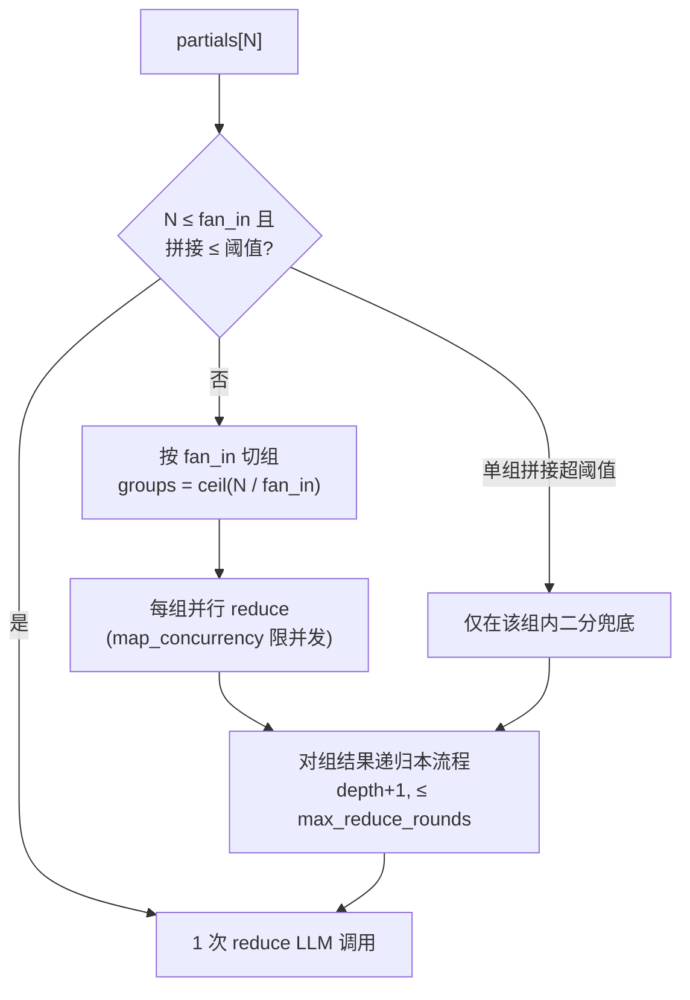

# Summarizer 经济性优化与成本可观测

**Planned-with:** Claude Opus 4.8
**Target repo path:** `examples/AgenticX-LongTextSummarizer/`
**关联 plan:** `examples/AgenticX-LongTextSummarizer/plans/2026-06-18-summarizer-v2-overview.plan.md`

---

## 0. 给执行者的话（Composer 2.5 必读）

- 本 plan 的所有代码改动**只动** `examples/AgenticX-LongTextSummarizer/` 子仓库内文件；主仓其他目录不要改。
- 子仓库是**独立 git**（不是 submodule，没有 `.gitmodules`），最终 commit 在子仓库内做，**不要**在主仓 `git add` 子仓库的内容。
- 遵循 `.cursor/rules/no-scope-creep.mdc`：每一改动必须对应下面某一条 FR；任何顺手优化先停下问用户。
- 每个任务节末有「验收命令」+「期望输出」，跑完就能自检。
- 全程不得删除 `legacy/`、`docs/`、`plans/` 任何已有文件。
- commit trailer 强制：`Plan-Id: 2026-06-18-summarizer-cost-efficiency` / `Plan-File: .cursor/plans/2026-06-18-summarizer-cost-efficiency.plan.md` / `Plan-Model: Claude Opus 4.8` / `Impl-Model: <你的模型名>` / `Made-with: Damon Li`。

---

## 1. 背景与问题

当前内核在长文本 / 多文档场景下「摘要后又摘要」是合理的（Map-Reduce + 跨文档 reduce），但存在 4 个具体经济性问题：

1. **Reduce 算法 vs 估算公式不一致**（最大单点损失）
   - `batch/resource.py::_reduce_calls` 按 `reduce_fan_in`（默认 8）分组算 reduce 调用数。
   - `core/engine.py::_reduce_partials` **完全不用 fan_in**，合并 prompt 超阈值时直接二分递归（每次产生 `left + right + merge = 3` 次调用）。
   - 后果：8 块合并按估算应是 1 次 reduce 调用；实际若超阈值会变成 3 次甚至更多；`ResourceEstimator` 给出的成本预报对调用方失真。

2. **缺少「调用前估算」接口**：调用方无法在真正调 LLM 之前知道一条请求会花多少次调用、多少 token、多大 RPM/TPM 压力。`ResourceEstimator` 已实现但未暴露 HTTP。

3. **缺少成本可观测**：`trace` 里有 `chunk_count`，但没有 `llm_calls` / `prompt_tokens_estimate` 等可统计字段，无法事后回归分析「Map-Reduce 占比 / 哪类输入最贵」。

4. **collection 估算口径不准 + 易跑飞**：
   - `app.py::v2_collection` 同步/异步阈值是 `len(docs) > sync_max_docs OR calls > 20`，硬编码 20。
   - `collection.py::_cross_reduce` 也是二分递归，没有 fan_in 分组。

本 plan 一次性解决上述 4 条；同时把「调用次数控制」做成可观测、可配置、可在请求级关闭的能力。

---

## 2. 目标 / 不做什么

### 目标（FR）

- **FR-1（必做）** Engine 的 reduce 改为「fan_in 分组优先 + 超大才二分兜底」，与 estimator 同口径。
- **FR-2（必做）** `SummarizeResult.trace` 暴露 `llm_calls` 与 `estimated_prompt_tokens`，零侵入式累计。
- **FR-3（必做）** 新增 `POST /v2/estimate` 端点：只算 ResourceEstimate，不调 LLM；支持单条与批量。
- **FR-4（必做）** Collection 的跨文档 reduce 同步走 fan_in 分组；`sync_max_docs` 与 `calls` 阈值改为可配置。
- **FR-5（必做）** README §3.2 / §3.4 / §3.5 同步更新算法描述（去掉「engine 用二分」的旧表述），新增「成本与调用次数」小节。
- **FR-6（必做）** 单测：fan_in reduce 调用数、estimate 端点契约、trace 字段、collection 大集合阈值。

### 不做（防止 scope creep）

- ❌ 不引入 token 级精细计费（按 provider 价目表算金额）。需要时另起 plan。
- ❌ 不改 prompt 模板本身（不动 `prompts/templates.yaml`）。
- ❌ 不动 Phase E 的 layered_resolver / personalization / skill 链路。
- ❌ 不引入 map 阶段的「小模型 + reduce 大模型」分层；这是另一个独立特性。
- ❌ 不改 v1 `/aibox/richMail/v1.0/intelliAbstract` 兼容契约。

---

## 3. 设计

### 3.1 Reduce 算法对齐（FR-1）

**目标**：合并 N 个 partial 时优先按 `reduce_fan_in` 分组顺序合并，仅当**单组**拼接仍超阈值才二分该组。



调用数语义对齐 `ResourceEstimator._reduce_calls`：N=8、fan_in=8 → 1 次；N=20、fan_in=8 → ceil(20/8)=3 组 → 3 次第 1 轮 + ceil(3/8)=1 第 2 轮 = 4 次。

### 3.2 成本可观测（FR-2）

`SummarizationEngine` 维护一个 `_CallCounter`（轻量 dataclass），在每次 `self.llm.complete(prompt)` 前后累计：

- `llm_calls`: int
- `estimated_prompt_tokens`: int（用 `count_tokens(prompt, model=...)` 累加）

最终写入 `result.trace["cost"] = {"llm_calls": N, "estimated_prompt_tokens": T}`。collection 与 batch 复用同一字段。

### 3.3 `/v2/estimate` 端点（FR-3）

```http
POST /v2/estimate
{
  "items": [{"content": "...", "domain": "email"}, ...]   // 必填，items[] 长度 ≥ 1
}
```

响应：

```json
{
  "code": 0,
  "data": {
    "per_item": [
      {"tokens": 9421, "n_chunks": 3, "calls": 4, "est_latency_s": 3,
       "required_rpm": 80, "required_tpm": 360448}
    ],
    "batch": {"calls": 4, "est_latency_s": 3, "required_rpm": 80, "required_tpm": 360448},
    "decision": "inline"   // CapacityGuard 用 in_flight=0/queue_size=0 试算
  }
}
```

不调任何 LLM，纯计算；调用方据此报价 / 选模型 / 决定是否拆分。

### 3.4 Collection 阈值可配置（FR-4）

`MultidocSettings` 新增：

```python
sync_max_calls: int = 20   # 估算 calls 超此阈值走异步
```

`app.py::v2_collection` 把硬编码 `20` 替换为 `app_config.multidoc.sync_max_calls`；`_cross_reduce` 改为 fan_in 分组（同 FR-1 算法），保持二分作为「单组超阈值」的兜底。

### 3.5 README 更新（FR-5）

- §3.2 mermaid：把「拼接后 token 超阈值 → 二分」换成「fan_in 分组优先，单组超阈值才二分」。
- §3.4 估算公式表：补一行「实际 reduce 调用与估算一致」。
- 新增 §3.9「成本与调用次数控制」（直接采用本 plan §1/§3.3 的内容精简化），含：
  - 各场景调用次数表
  - 6 条降本配置项及其权衡
  - `/v2/estimate` 用法示例

---

## 4. 任务分解（按顺序执行；每完成一节先跑该节验收再进下一节）

> 所有路径相对仓库根 `examples/AgenticX-LongTextSummarizer/`。

### Task 1 — Reduce 算法对齐（FR-1）

- 文件：`agenticx_service/core/engine.py`
- 改 `_reduce_partials`：实现 §3.1 算法。保留方法签名 `(partials, domain_name, ctx_base, depth) -> str`。
- 新增私有辅助 `_reduce_group(group, ...)`：负责单组（≤ fan_in 个 partial）拼接 + 解析 prompt + 调 LLM；若拼接超阈值则在组内二分。
- 主流程：
  1. 若 `len(partials) == 1`：直接 resolve+complete（不再嵌套）。
  2. 否则按 `fan_in = self.config.batch.reduce_fan_in` 切组（最后一组允许不足）。
  3. 各组并行 `_reduce_group`（用现有 `map_concurrency` 同款 semaphore；本任务**不**新增并发配置）。
  4. 组结果列表递归 `_reduce_partials(new_partials, ..., depth+1)`，直到 `len == 1` 或 `depth >= max_reduce_rounds`（达上限时一次性合并，不再递归）。
- 在 `_map_reduce` 的 `trace` 里追加 `trace["reduce_rounds"] = <最终深度+1>`（含首次入口）。
- **验收**：
  - `PYTHONPATH=".:../../" pytest agenticx_service/tests/test_phase2_mapreduce.py agenticx_service/tests/test_phase_a_core.py -q` → 全绿。
  - 手工 grep：`grep -n "midpoint" agenticx_service/core/engine.py` 应只剩「单组超阈值兜底」一处。

### Task 2 — 成本可观测（FR-2）

- 文件：`agenticx_service/core/engine.py`、`agenticx_service/llm_client.py`（仅读）
- 在 `SummarizationEngine` 内新增 dataclass：

  ```python
  @dataclass
  class _CallCost:
      llm_calls: int = 0
      estimated_prompt_tokens: int = 0
  ```

- 把 `self.llm.complete(prompt)` 全部包到一个私有 `async def _call_llm(self, prompt, cost)` 里：调用前 `cost.estimated_prompt_tokens += count_tokens(prompt, model=...)`，调用后 `cost.llm_calls += 1`，返回字符串。
- `summarize()` 顶部 `cost = _CallCost()`，所有路径（single / map / reduce）传入，最后写：

  ```python
  trace["cost"] = {"llm_calls": cost.llm_calls,
                   "estimated_prompt_tokens": cost.estimated_prompt_tokens}
  ```

- `CollectionSummarizer.summarize`：每篇得到 `result.trace["cost"]` 后累加到 `trace["cost"]`；跨文档 reduce 也走累计。**不要改 LLMClient**，保持薄封装语义。
- **验收**：新增 `tests/test_cost_trace.py`（见 Task 6）跑通；旧测试不退化。

### Task 3 — `/v2/estimate` 端点（FR-3）

- 文件：`agenticx_service/app.py`
- 新增 Pydantic：`EstimateItem`（`content: str`, `domain: str|None = None`）和 `EstimateBody`（`items: list[EstimateItem]`，校验 `min_length=1`）。
- 路由：

  ```python
  @app.post("/v2/estimate")
  async def v2_estimate(body: EstimateBody) -> JSONResponse: ...
  ```

  - 用 `count_tokens(item.content, model=app_config.llm.model)` 算每条 token。
  - `estimator.estimate_single(t)` 得到 per_item；`estimator.estimate_batch([...])` 得到 batch；`capacity.decide(batch, worker.in_flight, job_queue.size)` 得到 `decision`。
  - 输出结构同 §3.3。
- 不依赖任何 LLM。
- **验收**：新增 `tests/test_estimate_endpoint.py` 通过。

### Task 4 — Collection 阈值可配置（FR-4）

- 文件：`agenticx_service/config.py`、`agenticx_service/multidoc/collection.py`、`agenticx_service/app.py`、`config_agenticx.yaml`
- `MultidocSettings` 新增字段 `sync_max_calls: int = 20`。
- `app.py::v2_collection`：`large = len(docs) > app_config.multidoc.sync_max_docs or estimate.calls > app_config.multidoc.sync_max_calls`。
- `collection.py::_cross_reduce`：保留方法签名，把「拼接超阈值 → 二分」改成 §3.1 同款「fan_in 分组优先 + 单组超阈值兜底二分」。可抽出私有 `_reduce_block` 类似 engine 的 `_reduce_group`。
- `config_agenticx.yaml` 的 `multidoc:` 段加一行 `sync_max_calls: 20`（值与原硬编码保持一致，不影响行为）。
- **验收**：`pytest agenticx_service/tests/test_phase_d_multidoc.py -q` 全绿；新加 1 条断言验证 `sync_max_calls` 生效（Task 6）。

### Task 5 — README 更新（FR-5）

- 文件：`examples/AgenticX-LongTextSummarizer/README.md`
- §3.2 mermaid 与文字：替换为 §3.1 描述。
- §3.4 表后追加一行：「⚠️ 自 cost-efficiency 起，engine 的 reduce 实现已对齐本公式（fan_in 分组），估算与实际调用次数一致。」
- §7.x 新增「7.5 调用前估算」curl 示例。
- 新增 §3.9「成本与调用次数控制」：插在 §3.8 之后，§4 之前。内容来自本 plan §1（场景表）+ §3.3（estimate 端点）+ 6 条降本配置（沿用上一轮对话整理过的清单：提单次通过阈值、控 chunk_size、压 per_doc_summary_max_tokens、用 CapacityGuard、规则意图、关闭 layered_resolver）。
- **验收**：人工检查 README 渲染；目录链接对得上。

### Task 6 — 测试与冒烟（FR-6）

- 新增 `agenticx_service/tests/test_cost_efficiency.py`，至少 4 个用例：
  1. `test_reduce_fan_in_grouping`：构造 `partials=[…]×16`，stub LLM 返回固定短串使拼接不超阈值；断言总 LLM 调用 = `map_calls + ceil(16/8) + 1 = 16 + 2 + 1 = 19`（具体期望按 fan_in 推演，注释清楚）。
  2. `test_trace_cost_fields`：跑一条短摘要，断言 `result.trace["cost"]["llm_calls"] >= 1` 且 `estimated_prompt_tokens > 0`。
  3. `test_estimate_endpoint_inline`：`AsyncClient.post("/v2/estimate", json={"items":[{"content":"hello"}]})`，断言 `data.per_item[0].calls == 1` 且 `data.decision == "inline"`。
  4. `test_collection_async_by_calls`：构造若干文档使估算 `calls > sync_max_calls=2`（用 fixture 临时把 `sync_max_calls=2` 改小），断言响应 `status_code == 202` 且返回 `job_id`。
- 不动既有测试断言；若 trace 结构新增字段导致旧断言失败，**只**在测试里改宽（如 `assert "stages" in trace` 仍成立），不动断言语义。
- **验收**：`pytest agenticx_service/tests -q` 全绿，新增 4 条都跑到。

---

## 5. 全局验收

```bash
cd examples/AgenticX-LongTextSummarizer
PYTHONPATH=".:../../" pytest agenticx_service/tests -q
# 期望：60 passed（原 56 + 新增 4）

# 端点冒烟
PYTHONPATH=".:../../" python -m agenticx_service.app --config config_agenticx.yaml &
sleep 2
curl -s -X POST http://127.0.0.1:8282/v2/estimate \
  -H 'Content-Type: application/json' \
  -d '{"items":[{"content":"hello"}]}' | python -m json.tool
# 期望：data.per_item[0].calls=1, data.decision="inline"
kill %1
```

ReadLints 期望：0 errors。

---

## 6. 提交

子仓库 `examples/AgenticX-LongTextSummarizer/`：

```bash
git add agenticx_service/core/engine.py \
        agenticx_service/multidoc/collection.py \
        agenticx_service/app.py \
        agenticx_service/config.py \
        config_agenticx.yaml \
        agenticx_service/tests/test_cost_efficiency.py \
        README.md
git commit -m "$(cat <<'EOF'
feat(summarizer): reduce 算法对齐 estimator + 成本可观测 + /v2/estimate

## What & Why
对齐 engine.reduce 与 ResourceEstimator 的口径（fan_in 分组优先，
仅单组超阈值兜底二分），消除「估算偏低、实际多调」的隐性成本。
SummarizeResult.trace 增加 llm_calls / estimated_prompt_tokens；
新增 /v2/estimate 不调 LLM 的纯估算接口；collection 同步阈值可配置。

## Requirements
- FR-1: engine reduce fan_in 分组，与 estimator 同口径
- FR-2: trace.cost 暴露调用数与 prompt token 估算
- FR-3: POST /v2/estimate 提供调用前成本预报
- FR-4: multidoc.sync_max_calls 可配置；collection cross_reduce 也走 fan_in
- FR-5: README §3.2/§3.4/§3.9 同步算法与成本说明
- AC-1: pytest 60 passed；ReadLints 0

Plan-Id: 2026-06-18-summarizer-cost-efficiency
Plan-File: .cursor/plans/2026-06-18-summarizer-cost-efficiency.plan.md
Plan-Model: Claude Opus 4.8
Impl-Model: <fill_in>
Made-with: Damon Li
EOF
)"
```

主仓需要单独把本 plan 文件提交：

```bash
cd ../../    # 回到 AgenticX 根
git add .cursor/plans/2026-06-18-summarizer-cost-efficiency.plan.md
git commit -m "$(cat <<'EOF'
docs(plan): summarizer 经济性优化 + 成本可观测 plan

Plan-Id: 2026-06-18-summarizer-cost-efficiency
Plan-File: .cursor/plans/2026-06-18-summarizer-cost-efficiency.plan.md
Plan-Model: Claude Opus 4.8
Impl-Model: <fill_in>
Made-with: Damon Li
EOF
)"
```

---

## 7. 风险与回退

| 风险 | 监测 | 回退 |
|---|---|---|
| fan_in 分组后摘要质量下降（合并面变大） | Phase 4 评测脚本 `run_eval` 跑 `email_long_chain` / `news_deep`，比较修改前后 `faithfulness` | 把 `reduce_fan_in` 调小（如 4 / 2），无需改代码 |
| `/v2/estimate` 被大量调用导致 CPU 抖动 | 接入 nginx 限流；本身无 LLM 调用，主要成本是 `count_tokens` | 关掉路由或 `enable_estimate: false`（本 plan 默认开） |
| trace 增加字段导致下游 schema 不兼容 | 字段全部加在 `trace.cost` 子对象内，旧消费者读 `result.text/domain/overflow_level` 不受影响 | 删字段即恢复 |

---

## 8. Definition of Done

- 所有 FR 落地并通过验收命令。
- 主仓 plan + 子仓库代码两个 commit 都已生成，trailer 完整。
- README 与代码事实一致：不再出现「engine 用二分递归」的旧描述。
- Code review 时执行者主动报告：本 plan 是否触发任何「计划外修改」；若有须列原因并征得用户同意。
