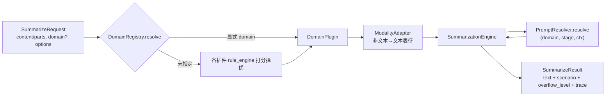
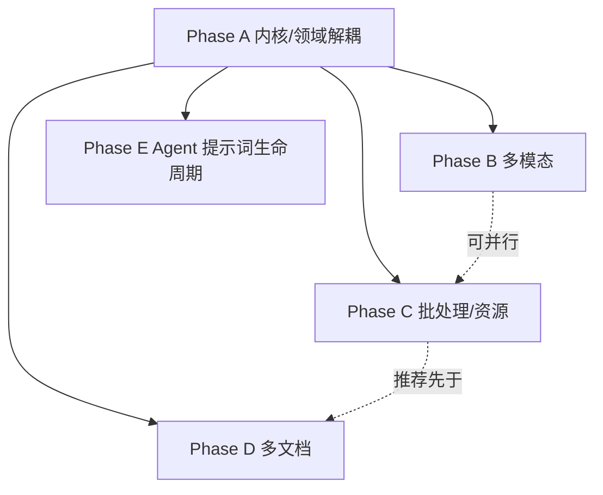

# Summarizer v2 - 业务无关内核 + 领域插件化 重构总览

**Author:** Damon Li
**Date:** 2026-06-18
**Planned-with:** Claude Opus 4.8
**代码根目录:** `examples/AgenticX-LongTextSummarizer/agenticx_service/`
**前置实现:** v1（Phase 1–4）已落地：FastAPI 入口、单块/Map-Reduce、email/news 意图路由、Token 溢出、LLMJudge 评测。

> ⚠️ 给实施者（Composer 2.5）的强制要求：
> 1. 动手任何子 plan 前，**先读本文件第 2/3/4 节**，再读该子 plan 引用的现有源码文件，确认 API 真实存在。
> 2. **禁止** 推测不存在的 AgenticX API；本总览第 4 节列出的「已核实 API」可直接用，未列出的必须先 `Read` 源码确认。
> 3. 遵守 `no-scope-creep`：只改子 plan 任务清单点名的文件，不顺手重构无关逻辑。
> 4. 每个子 plan 结束须 `pytest` 跑通该阶段冒烟测试，且不修改 `agenticx/` 框架源码。

---

## 1. 为什么重构

v1 的内核（分块 / Map-Reduce / 溢出 / LLM 调用）已经与「邮件」无关，但对外形态仍深度捆绑富邮件摘要：

| 耦合点 | v1 现状 | v2 目标 |
|--------|---------|---------|
| HTTP 契约 | 仅 `/aibox/richMail/.../intelliAbstract` + `email_content` | 新增 `/v2/summarize`（通用 `content`/`domain`/`modalities`），旧路径保留为兼容 shim |
| 领域逻辑 | `intent.py` 里 email/news 硬编码命中词 + summarizer 直接拼 prompt | `DomainPlugin` 协议：每个领域自带规则引擎、prompt id、模态策略 |
| 提示词 | `templates.yaml` 写死，改需求＝改文件 | `PromptResolver` 分层：静态 → 冷启动固化 → skill 覆盖 → 用户个性化记忆 |
| 模态 | 仅纯文本 | `ModalityAdapter` 能力矩阵：文本/图片/代码/文档（音视频预留） |
| 规模 | 单文档单请求 | 批处理 + 资源评估 + 队列降级；多文档跨篇摘要 |

核心理念：**摘要内核业务无关，领域能力以插件下沉，提示词可被 Agent 与用户共同迭代。**

---

## 2. 目标架构

### 2.1 分层与目录

```
agenticx_service/
├── core/                     # 【Phase A】业务无关摘要内核（不得出现 email/news 字样）
│   ├── types.py              # SummarizeRequest / SummarizeResult / Modality / Stage 枚举
│   ├── engine.py             # SummarizationEngine: ingest→guard→route→map→reduce
│   ├── prompt_resolver.py    # PromptResolver 协议 + StaticPromptResolver（接缝，A 只做静态层）
│   └── pipeline.py           # Stage 协议（可选，供 B/D 扩展插桩）
├── domains/                  # 【Phase A】可插拔领域
│   ├── base.py               # DomainPlugin 协议 + DomainRegistry
│   ├── email/{plugin.py,rules.py}
│   └── news/{plugin.py,rules.py}
├── modality/                 # 【Phase B】多模态接入边界
│   ├── base.py               # ModalityAdapter 协议 + CapabilityMatrix
│   ├── text.py / image.py / code.py / document.py
│   └── audio_video.py        # 预留 skeleton，默认 NotSupported
├── batch/                    # 【Phase C】批处理 + 资源评估 + 队列
│   ├── resource.py           # ResourceEstimator / CapacityGuard
│   ├── queue.py / worker.py
├── multidoc/                 # 【Phase D】多文档摘要
│   └── collection.py         # 跨文档 reduce（compare/timeline/aggregate）
├── agentic/                  # 【Phase E】提示词生命周期
│   ├── eval_harness.py       # 冷启动批量提示词评测（扩展 evaluation/）
│   ├── prompt_freeze.py      # 固化获胜 prompt → 版本化 frozen store
│   ├── personalization.py    # 用户反馈 → WorkspaceMemoryStore → 动态注入
│   └── skill_author.py       # Agent 落盘 SKILL.md 覆盖未覆盖场景
├── prompts/                  # 静态模板（v1 既有，A 阶段拆分 domain 命名空间）
├── evaluation/               # v1 既有，E 阶段复用并扩展
└── app.py                    # FastAPI：v2 路由 + richMail 兼容 shim
```

### 2.2 数据流（v2 单请求）



关键点：`SummarizationEngine` 只认 `domain` 提供的 **prompt id** 与 **模态策略**，自身不含任何业务词；领域差异全部收敛进 `DomainPlugin`。

---

## 3. 分层契约（各 Phase 必须遵守的稳定接口）

> 这些契约在 Phase A 定义后冻结。B/C/D/E 只能**新增**实现，不得改签名（除非该 Phase plan 明确允许）。

- `DomainPlugin`（`domains/base.py`）至少暴露：
  - `name: str`
  - `rule_engine.score(content: str) -> float`（0–1，用于无显式 domain 时择优）
  - `prompt_ids() -> dict[str, str]`（如 `{"single": "...", "map": "...", "reduce": "..."}`）
  - `supported_modalities() -> set[Modality]`
  - `postprocess(summary: str, ctx) -> str`（领域级后处理，可空实现）
- `PromptResolver`（`core/prompt_resolver.py`）：
  - `async resolve(domain: str, stage: str, ctx: dict) -> str`
  - A 阶段只实现 `StaticPromptResolver`（读 `prompts/`）；E 阶段实现 `LayeredPromptResolver` 叠加 frozen/skill/personalization。
- `ModalityAdapter`（`modality/base.py`，Phase B）：
  - `modality: Modality`；`can_handle(part) -> bool`；`async to_text(part, ctx) -> TextRepr`
- `SummarizeRequest/Result`（`core/types.py`）：v2 统一载体；`Result` 必带 `trace` 字段记录走过的 domain/stage/modality，便于评测与排障。

---

## 4. 已核实的真实 API（可直接引用，已在仓库核对）

```python
# LLM 调用（薄封装已存在）
from agenticx_service.llm_client import LLMClient        # .complete(prompt: str|list[dict]) -> str (async)

# 分块
from agenticx_service.chunking import TextChunker         # await .split(text) -> list[str]

# 溢出
from agenticx_service.overflow import OverflowGuard       # .guard_input / .wrap_result / .failure_message

# Token
from agenticx.core.token_counter import count_tokens, truncate_text

# 提示词
from agenticx_service.prompts.registry import PromptRegistry  # .format(name, **kwargs) -> str

# 评测（Phase E 复用）
from agenticx.evaluation.llm_judge import LLMJudge, CompositeJudge, JudgeMode, JudgeResult, MockLLMProvider
# LLMJudge(rubric, mode=JudgeMode.BINARY, llm_provider=...); await judge.evaluate(output, inputs) -> JudgeResult(.value/.reason)
# CompositeJudge(judges=[...], aggregation="all"); await .evaluate(output, inputs)

# 多模态能力判定（Phase B）
import agenticx.llms.vision as vision                     # 模型是否支持图像的判定逻辑参考此文件

# 记忆（Phase E 个性化）—— 使用前务必 Read 确认 add/append 签名
from agenticx.memory.workspace_memory import WorkspaceMemoryStore  # await .search(query, limit, mode="hybrid")

# 技能（Phase E skill 自著）—— 使用前务必 Read 确认写盘方式
import agenticx.skills.registry as skill_registry
import agenticx.skills.guard as skill_guard               # 落盘前安全扫描
```

> 未列出的 API（如 `WorkspaceMemoryStore.add`、skill 写盘函数、`vision` 具体函数名）**必须先 Read 源码确认**，不得凭名臆造。

---

## 5. 设计护栏（务必遵守，违反将导致返工）

1. **内核零业务词**：`core/` 下任何文件不得出现 `email`/`news`/`mail` 等领域词；领域差异只能通过 `DomainPlugin` 注入。
2. **向后兼容**：`/aibox/richMail/v1.0/intelliAbstract` 与其响应形状（`code/message/text/data`）**必须保留**且行为不变；v2 新增独立路由，不得改旧路由语义。
3. **不重复造轮子**：分块/Token/LLM/评测一律复用第 4 节既有能力；多模态转写优先复用框架 `liteparse`/vision，不自写解析器。
4. **不引入 `OverflowRecoveryPipeline`**（与 Agent 编译器耦合，沿用 v1 的 `OverflowGuard`）。
5. **提示词分层只增不改**：E 阶段的 frozen/skill/personalization 都是**叠加层**，静态模板永远是最后兜底，保证任何用户态故障都能回落到可用 prompt。
6. **资源评估要给数字**：Phase C 必须产出可计算的资源下限公式与配置项，不能停留在「加个队列」。
7. **每个 Phase 自带 mock 路径**：所有冒烟测试在 `MockLLMProvider` / stub 下可跑通，不依赖真实 API key。

---

## 6. 子 Plan 索引与执行顺序

| 顺序 | Plan 文件 | 目标 | 依赖 |
|:--:|---|---|---|
| 1 | `2026-06-18-summarizer-v2-phase-a-core-domain-decoupling.plan.md` | 内核业务无关化 + DomainPlugin(email/news 规则引擎) + v2 API + PromptResolver 接缝 | v1 |
| 2 | `2026-06-18-summarizer-v2-phase-b-multimodal-ingestion.plan.md` | 多模态接入边界（文本/图片/代码/文档，音视频预留） | A |
| 3 | `2026-06-18-summarizer-v2-phase-c-batch-resource-queue.plan.md` | 批处理 + 资源评估体系 + 队列降级 | A（可与 B 并行） |
| 4 | `2026-06-18-summarizer-v2-phase-d-multidoc.plan.md` | 多篇长文档摘要（跨文档 reduce） | A；建议在 C 之后以复用批处理 |
| 5 | `2026-06-18-summarizer-v2-phase-e-agentic-prompt-lifecycle.plan.md` | 冷启动批测固化 + 个性化记忆注入 + skill 自著 | A（强依赖 PromptResolver 接缝）；建议最后做 |

### 依赖图



**推荐串行顺序：A → B → C → D → E。**
A 是一切的地基（定义稳定契约 + PromptResolver 接缝）；E 放最后，因为它依赖 A 的提示词分层接缝，且需要 B/C/D 暴露的 trace 与评测数据作为「冷启动批测」与「个性化」的输入。B 与 C 之间无强依赖，资源紧张时可先 B 后 C；D 复用 C 的并发/资源能力效果最好，故排在 C 后。

---

## 7. 全局验收基线

- v1 旧契约回归：`/aibox/richMail/...` 行为不变（保留 `test_app.py` 并新增 v2 用例）。
- 每 Phase 新增 `agenticx_service/tests/test_phase_<x>_*.py`，`MockLLMProvider`/stub 下全绿。
- 内核 grep 检查：`rg -i "email|news|mail" agenticx_service/core/` 应无业务命中（除注释引用领域名作为示例外）。
- 文档：每 Phase 结束在 `README.md` 对应章节补充该能力（不删旧内容）。

Made-with: Damon Li
