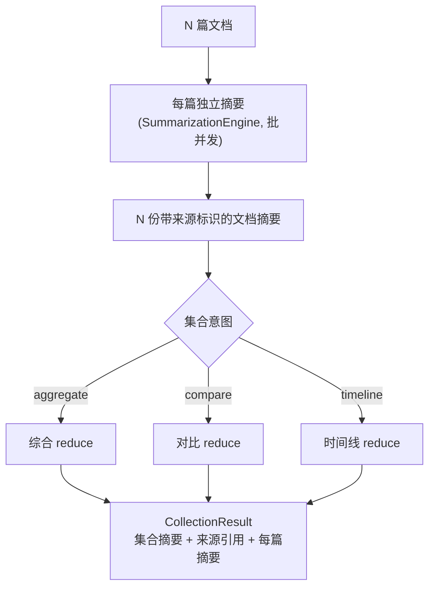

# Phase D - 多篇长文档摘要

**Author:** Damon Li
**Date:** 2026-06-18
**Planned-with:** Claude Opus 4.8
**前置:** Phase A 完成；强烈建议 Phase C 完成（复用批并发与队列处理大集合）。

## 目标

把「单文档摘要」升维到「文档集合摘要」：输入多篇文档，输出一份**跨文档**的集合摘要，支持三种集合意图：

| 集合意图 | 语义 | 典型场景 |
|----------|------|----------|
| `aggregate` | 综合归纳多篇共同主题 | 一组邮件往来、专题多篇报道 |
| `compare` | 对比多篇异同/立场 | 多方对同一事件的报道对比 |
| `timeline` | 按时间线串联事件演进 | 项目邮件链、连续报道 |

## 两阶段结构（map-of-maps → cross reduce）



- 第一阶段：每篇走 Phase A 引擎（含其自身的单块/Map-Reduce、领域路由、多模态），并发由 Phase C 的 `batch_concurrency` 控制。
- 第二阶段：把 N 份文档摘要作为输入，按集合意图选模板做**跨文档 reduce**；输出保留来源标识（doc_id/标题）以便引用与追溯。

## 新增/变更文件

```
agenticx_service/multidoc/
  __init__.py
  types.py          # CollectionRequest/CollectionResult/CollectionIntent
  collection.py     # CollectionSummarizer：per-doc → cross reduce
agenticx_service/prompts/templates.yaml   # 变更：collection.aggregate/compare/timeline
agenticx_service/app.py                    # 变更：/v2/summarize/collection
config_agenticx.yaml                       # 变更：multidoc 段（per_doc_summary_max_tokens 等）
```

## 任务清单

- [ ] **D1 类型** `multidoc/types.py`
  - `class CollectionIntent(str, Enum)`: `AGGREGATE/COMPARE/TIMELINE`。
  - `@dataclass DocInput`: `doc_id: str`、`title: str | None`、`content: str`、`domain: str | None`、`parts: list | None`（兼容 B 的多模态）。
  - `@dataclass CollectionRequest`: `docs: list[DocInput]`、`intent: CollectionIntent = AGGREGATE`、`options: dict`。
  - `@dataclass CollectionResult`: `summary: str`、`intent`、`per_doc: list[{doc_id,title,summary}]`、`trace: dict`。

- [ ] **D2 每篇摘要** `multidoc/collection.py`
  - `CollectionSummarizer` 注入 `SummarizationEngine`（+ 可选 Phase C 的批并发器）。
  - 对每个 `DocInput` 构造 `SummarizeRequest` 调引擎；并发用 `Semaphore(batch_concurrency)`；保留 `doc_id/title` 与每篇摘要的映射。
  - 每篇摘要超 `per_doc_summary_max_tokens` 时再压缩（二次单块摘要），保证进入 cross reduce 的总量可控。

- [ ] **D3 跨文档 reduce**
  - 组装输入：`[Doc 1｜<title>] <summary>` 编号列表（保留来源标识，供引用）。
  - 总量仍可能超阈值 → 复用 Map-Reduce 的多级 reduce 思路对「文档摘要集合」再分块归并（`max_reduce_rounds` 收敛）。
  - 按 `intent` 选模板（D4）；可选去重/聚类：同主题文档摘要相似度高时合并（先做基于规则/重叠的轻量去重，避免引入向量依赖；如需向量再单列）。

- [ ] **D4 集合模板** `prompts/templates.yaml`
  - `collection.aggregate`：综合归纳共同主题与关键结论，去重，保留来源编号。
  - `collection.compare`：列出共识点 / 分歧点 / 各篇独有观点。
  - `collection.timeline`：抽取时间点与事件，按时间排序成演进脉络。
  - 三模板都要求**引用来源编号**（如「据 Doc 2」），便于追溯。

- [ ] **D5 集合 API** `app.py`
  - `POST /v2/summarize/collection`：`{docs:[...], intent?, options?}`。
  - 小集合（文档数 ≤ 配置阈值且总量可控）同步返回；大集合走 Phase C 队列返回 `job_id`（job 类型扩展为 `collection`）。
  - 响应含 `summary`、`per_doc`、`trace`（记录每篇路径与 cross-reduce 轮数）。

- [ ] **D6 测试 + 文档**（见下）。

## 冒烟测试 `tests/test_phase_d_multidoc.py`

- `test_aggregate_two_docs`（stub LLM）：2 篇 → 集合摘要非空，`per_doc` 含 2 项，trace 记录两阶段。
- `test_compare_intent_uses_compare_template`：intent=compare 时解析到 `collection.compare`。
- `test_timeline_intent_orders_events`：intent=timeline 走 timeline 模板。
- `test_large_collection_multi_level_reduce`：文档摘要总量超阈值时触发多级 cross reduce（trace 轮数 > 1）。
- `test_collection_endpoint_small_sync`：小集合同步返回结构完整。
- `test_collection_endpoint_large_enqueue`（依赖 C）：大集合返回 `job_id`，可经 worker 完成。

## 设计护栏

- 每篇摘要必须复用 `SummarizationEngine`，**不另起一套编排**（领域路由/多模态/溢出自动继承）。
- cross reduce 必须保留来源标识与引用，避免「摘要的摘要」丢失可追溯性。
- 去重先用轻量规则，不擅自引入向量库/embedding 依赖（如确需，另开 plan）。
- 大集合务必走 Phase C 队列，避免单请求长时间阻塞事件循环。

## 验收标准

1. 三种集合意图均可端到端产出带来源引用的集合摘要（stub 下）。
2. 大集合自动多级 cross reduce 且不超上下文；超规模走队列。
3. `per_doc` 与 `trace` 完整，可追溯每篇来源与处理路径。
4. README 新增「多文档集合摘要」章（含两阶段图与三意图说明）。

Made-with: Damon Li
