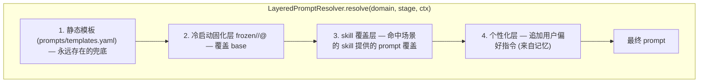

# Phase E - Agent 化提示词生命周期

**Author:** Damon Li
**Date:** 2026-06-18
**Planned-with:** Claude Opus 4.8
**前置:** Phase A 完成（`PromptResolver` 接缝 + `core/types.py` 的 trace）。建议 B/C/D 完成，使评测数据与场景覆盖更真实。

## 解决的痛点

传统做法：提示词写死 → 用户提需求 → 工程改提示词 → 上线。本 Phase 让提示词具备**生命周期**：

| 阶段 | 能力 | 谁参与 |
|------|------|--------|
| 冷启动（上线前） | 批量评测多个候选提示词，选最优并「固化」 | 工程 + 自动评委 |
| 运行中（个性化） | 用户说「希望更简短/保留数字」→ 沉淀为个性化记忆，动态注入 | 终端用户 |
| 运行中（场景扩展） | 某场景未覆盖好 → Agent 自动落盘一个 skill 补该场景提示词 | Agent |

## 分层提示词解析（核心机制）

A 阶段已留 `PromptResolver` 接缝。E 把它实现为 `LayeredPromptResolver`，按优先级**叠加**（高层覆盖/追加低层，静态层永远兜底）：



> 护栏：任一上层缺失/出错都必须静默回落到下层，**保证永远能解析出一个可用 prompt**；个性化层只能**追加约束**，不能整段替换核心指令，防止用户偏好把模板带崩。

## 已核实可复用能力（使用前仍需 Read 确认细节）

- 评测：`agenticx.evaluation.llm_judge`（`LLMJudge`/`CompositeJudge`/`MockLLMProvider`），v1 `evaluation/judges.py`/`run_eval.py` 已有用法可直接扩展。
- 记忆：`agenticx.memory.workspace_memory.WorkspaceMemoryStore`（确认 `add`/写入 API 后再用；`search(query, limit, mode)` 已确认）。
- 技能：`agenticx.skills`（`registry`/`frontmatter`/`guard`）。落盘前必须用 `agenticx.skills.guard`（`scan_skill`/`should_allow` 一类）做安全扫描；写盘路径与 frontmatter 结构先 `Read` 框架确认。

## 新增/变更文件

```
agenticx_service/
  core/prompt_resolver.py        # 变更：新增 LayeredPromptResolver（保留 StaticPromptResolver）
  agentic/
    __init__.py
    eval_harness.py              # 冷启动批量评测
    prompt_freeze.py             # 固化 / 版本化 frozen store
    personalization.py           # 反馈→记忆→注入
    skill_author.py              # skill 自著
  prompts/frozen/                # 固化产物目录（manifest.yaml + <domain>/<stage>@<ver>.txt）
  app.py                         # 变更：反馈接口
config_agenticx.yaml             # 变更：agentic 段（eval/freeze/personalization/skill 开关与阈值）
scripts/run_prompt_eval.py       # 冷启动批测 CLI（可放 agenticx_service/agentic/__main__.py）
```

## 任务清单

- [ ] **E1 分层解析器** `core/prompt_resolver.py`
  - 新增 `LayeredPromptResolver(PromptResolver)`，按上图四层组装；构造注入 `frozen_store`、`skill_provider`、`personalization` 三个可选源（任一为 None 即跳过该层）。
  - `ctx` 增加 `user_id`（个性化用）与 `scenario_hint`（skill 命中用）。
  - 保证：四层全失效时退化为 `StaticPromptResolver` 行为。`trace["prompt_layers"]` 记录实际生效了哪几层。
  - 引擎默认仍可用 `StaticPromptResolver`；通过配置 `agentic.layered_resolver: true` 切到分层版（默认 false，保证 A–D 行为不变）。

- [ ] **E2 冷启动批量评测** `agentic/eval_harness.py`
  - 输入：候选提示词集合（`{candidate_id: template}`，可来自文件/人工）× 评测数据集（复用 `evaluation/datasets/`）。
  - 对每个候选 × 每条数据：用候选 prompt 跑摘要（可 stub/真实），再用 `CompositeJudge`（复用 `evaluation/judges.py`）+ 硬断言（PII/overflow）打分。
  - 产出排名报告：每候选的分维度均分、硬失败数、综合得分；落盘 `agentic/eval_report_<ts>.json/.md`。
  - **不依赖真实 key**：默认 `MockLLMProvider`，可跑 CI；真实评测经 env 开关（沿用 `AGX_EVAL_USE_MOCK_JUDGE`）。

- [ ] **E3 固化** `agentic/prompt_freeze.py`
  - `freeze(domain, stage, template, meta) -> version`：把获胜模板写入 `prompts/frozen/<domain>/<stage>@<ver>.txt`，并更新 `prompts/frozen/manifest.yaml`（记录 `domain/stage → 当前生效 version`、来源 `eval_report`、时间、得分）。
  - `FrozenPromptStore.get(domain, stage) -> str | None`：供 `LayeredPromptResolver` 第 2 层读取（按 manifest 当前生效版本）。
  - 版本只增不改（保留历史，便于回滚）；manifest 切换生效版本即可灰度/回滚。

- [ ] **E4 个性化记忆注入** `agentic/personalization.py`
  - 反馈入库：`record_feedback(user_id, domain, instruction)`（如「更简短」「务必保留数字与金额」）→ 归一化为简短指令 → 写入 `WorkspaceMemoryStore`（key 含 `user_id`+`domain`+命名空间 `summarizer_pref`）。先 `Read` 确认写入 API。
  - 注入：`build_personalization_block(user_id, domain) -> str`：`search` 该用户该域的偏好记忆，拼成「# 用户个性化要求」追加段，供 `LayeredPromptResolver` 第 4 层 append。
  - 约束：个性化块只追加、有长度上限、与核心模板冲突时核心优先（在追加段显式声明「在不违反上述要求前提下」）。

- [ ] **E5 skill 自著** `agentic/skill_author.py`
  - 触发：当某请求的场景未被现有 domain/frozen 覆盖（如评委分持续偏低，或 domain 规则全 0 命中默认），允许 Agent 起草一个 skill。
  - 流程：LLM 起草 `SKILL.md`（含 frontmatter：name/description/激活条件 + 一段该场景的 map/single/reduce 提示词）→ `agenticx.skills.guard` 安全扫描（拒绝 exfiltration/credential/injection/destructive）→ 通过则落盘到技能目录（`Read` 框架确认路径，如 `~/.agenticx/skills/<name>/SKILL.md`）。
  - `SkillPromptProvider.get(domain, stage, scenario_hint) -> str | None`：供 `LayeredPromptResolver` 第 3 层；按激活条件匹配已落盘 skill 的提示词。
  - 开关 `agentic.skill_authoring: false` 默认关闭（与框架 `AGX_SKILL_MANAGE` 默认关一致），显式开启才允许写盘。

- [ ] **E6 接口与 CLI** `app.py` / CLI
  - `POST /v2/feedback`：`{user_id, domain, instruction}` → `personalization.record_feedback`。
  - `/v2/summarize` 增加可选 `user_id`，透传到引擎 → resolver 个性化层。
  - 冷启动 CLI：`python -m agenticx_service.agentic`（或 `scripts/run_prompt_eval.py`）跑 E2 评测 + 可选 `--freeze <candidate_id>` 触发 E3 固化。

- [ ] **E7 测试 + 文档**（见下）。

## 冒烟测试 `tests/test_phase_e_agentic.py`

- `test_layered_resolver_priority`：构造 base/frozen/skill/personalization 四层桩，断言叠加优先级与 `trace["prompt_layers"]` 正确；上层缺失时回落 base。
- `test_layered_resolver_falls_back_to_static`：所有上层为 None 时等价 StaticPromptResolver 输出。
- `test_eval_harness_ranks_candidates`（mock judge）：两个候选跑评测，产出排名，PII 泄漏候选被硬失败压到最低。
- `test_freeze_and_load`：`freeze` 后 `FrozenPromptStore.get` 返回固化模板，manifest 记录生效版本；再 freeze 新版本可切换。
- `test_personalization_appends_only`：录入「更简短」偏好后，注入块出现在 prompt 末尾且不替换核心指令；无偏好时不注入。
- `test_skill_author_guard_blocks_dangerous`（mock）：起草含危险指令的 skill 被 guard 拦截不落盘；安全 skill 通过并可被 `SkillPromptProvider` 命中。
- `test_default_behavior_unchanged`：`layered_resolver=false` 时引擎输出与 A 阶段一致（保护 A–D 回归）。

## 设计护栏

- **静态层永远兜底**：任何上层异常/缺失都回落，绝不能让用户态故障导致「无 prompt 可用」。
- **个性化只追加不替换**：防止用户偏好把核心摘要约束（如不泄漏 PII）覆盖掉；PII/硬约束始终来自核心层与硬断言。
- **skill 落盘必经 guard 扫描**，默认关闭写盘开关；写盘路径/格式以框架真实实现为准（先 Read）。
- **固化只增版本不改旧文件**，支持回滚；frozen 与 skill 都不得修改 `prompts/templates.yaml` 静态兜底。
- 复用 `evaluation/` 既有评委与数据集，不另造评测框架。

## 验收标准

1. `LayeredPromptResolver` 四层叠加优先级正确、可回落，trace 可观测；`layered_resolver=false` 时 A–D 行为零变化。
2. 冷启动 CLI 可对多候选批量评测出排名，并将获胜版本固化为可加载的 frozen prompt（含 manifest 与回滚能力）。
3. 用户反馈可沉淀为个性化记忆并以"追加约束"形式动态注入，不破坏核心约束。
4. 未覆盖场景下 Agent 可（在开关开启时）起草并经安全扫描落盘 skill，且该 skill 提示词可被 resolver 命中生效。
5. 全部冒烟测试在 mock 下通过；不修改 `agenticx/` 框架源码。

Made-with: Damon Li
